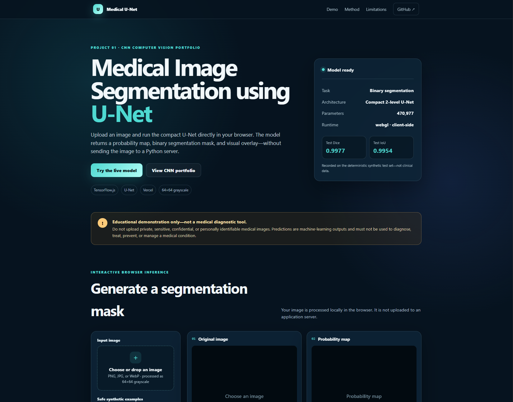
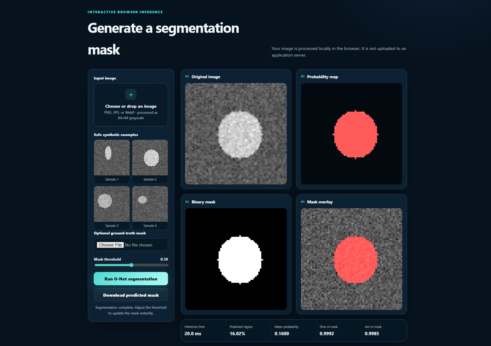
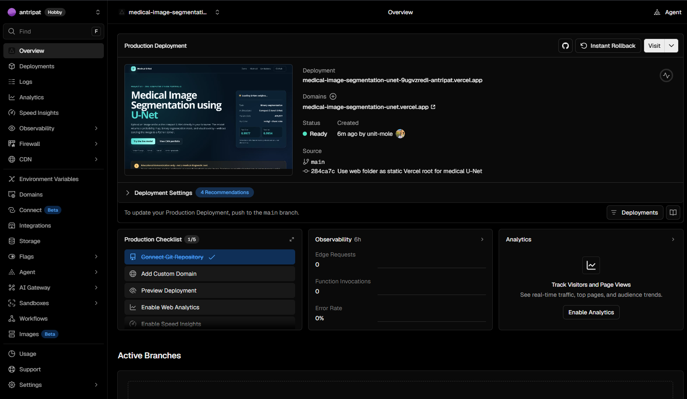

# Medical Image Segmentation using U-Net

[](https://www.python.org/)
[](https://www.tensorflow.org/)
[](https://www.tensorflow.org/js)
[](https://medical-image-segmentation-unet.vercel.app/)
[](https://github.com/unit-mole/cnn-projects/actions/workflows/01-image-segmentation-unet-medical-imaging.yml)
[](LICENSE)

An end-to-end computer vision project that uses a compact **U-Net** to perform binary image segmentation on deterministic synthetic MRI-style grayscale images. The repository includes reproducible synthetic-data generation, preprocessing, U-Net training, Dice/IoU evaluation, saved Keras artifacts, error analysis, automated tests, GitHub Actions, and a static **TensorFlow.js** application deployed on **Vercel**.

**Status:** Portfolio-ready, CI-tested, and deployed  
**Live demo:** [Open the Medical U-Net application](https://medical-image-segmentation-unet.vercel.app/)  
**Source repository:** [unit-mole/cnn-projects](https://github.com/unit-mole/cnn-projects)  
**Primary stack:** Python · TensorFlow · Keras · U-Net · TensorFlow.js · JavaScript · HTML · CSS · Vercel

---

## Responsible Use

This project is for educational and portfolio demonstration purposes only.

- The model was trained on deterministic **synthetic MRI-style images**, not real patient scans.
- It is not clinically validated and must not be used for diagnosis, treatment, triage, screening, or medical decision-making.
- Do not upload private, confidential, sensitive, or personally identifiable medical images.
- Model predictions can be incomplete or incorrect and require appropriate human review.
- The high test scores reflect a controlled synthetic dataset and should not be interpreted as real-world clinical performance.

---

## Business Problem

Image segmentation assigns a class label to every pixel and is useful when a system must identify the exact location and shape of a region rather than only classify the complete image.

This project answers:

> Given a grayscale image, can a compact U-Net estimate the pixel-level location of a foreground region and return a probability map, binary mask, and visual overlay?

The deployed browser pipeline returns:

- Original preprocessed image
- Pixel-level probability map
- Binary segmentation mask
- Segmentation overlay
- Predicted-region percentage
- Mean foreground probability
- Dice score when a reference mask is available
- IoU score when a reference mask is available
- Downloadable predicted mask

---

## Project Objective

Build a portfolio-ready computer vision solution that can:

1. Generate a deterministic synthetic image-segmentation dataset.
2. Validate and normalize grayscale image inputs.
3. Train a compact two-level U-Net.
4. Compare the U-Net against an intensity-threshold baseline.
5. Evaluate predictions using Dice, IoU, and pixel accuracy.
6. Save and reload the trained Keras model.
7. Export the trained inference weights for TensorFlow.js.
8. Run segmentation directly inside the browser.
9. Deploy the static application on Vercel without a Python server.
10. Preserve reproducibility through tests, metadata, validation scripts, and GitHub Actions.

---

## Dataset

The executable project uses a deterministic synthetic dataset designed to demonstrate the complete engineering workflow for binary medical-style image segmentation.

### Dataset characteristics

| Property | Value |
|---|---|
| Total samples | 2,500 |
| Image size | 64 × 64 |
| Channels | 1 grayscale channel |
| Task | Binary semantic segmentation |
| Training samples | 1,750 |
| Validation samples | 375 |
| Test samples | 375 |
| Random seed | 42 |
| Foreground pattern | Bright elliptical region |
| Background pattern | Noisy grayscale field |

Each image contains a brighter synthetic elliptical foreground region against a noisy background. The corresponding mask identifies the ellipse at the pixel level.

Only safe synthetic examples are distributed with the browser application.

---

## Tools and Technologies

| Area | Technology |
|---|---|
| Language | Python, JavaScript |
| Deep learning | TensorFlow, Keras |
| Architecture | Compact two-level U-Net |
| Browser inference | TensorFlow.js |
| Data processing | NumPy, Pillow |
| Evaluation | Dice, IoU, pixel accuracy |
| Visualization | Matplotlib, HTML Canvas |
| Frontend | HTML, CSS, JavaScript |
| Model persistence | `.keras`, JSON, TensorFlow.js weights |
| Testing / quality | pytest, compile checks, static validators |
| CI | GitHub Actions |
| Hosting | Vercel |
| Browser runtime | WebGL with client-side inference |

---

## Project Workflow

```text
Deterministic synthetic images and masks
                │
                ▼
Input validation and grayscale normalization
                │
                ▼
Train / validation / test split
                │
                ▼
Intensity-threshold baseline
                │
                ▼
Compact two-level U-Net training
                │
                ▼
Dice, IoU, and pixel-accuracy evaluation
                │
                ▼
Saved Keras model and metadata
                │
                ▼
TensorFlow.js model export and validation
                │
                ▼
Static browser application
                │
                ▼
Vercel production deployment
```

---

## Image Preprocessing

The inference pipeline applies the same core transformations used by the trained model:

- Convert uploaded images to grayscale.
- Resize images to `64 × 64`.
- Cast pixel values to floating-point values.
- Normalize pixel intensities to `[0, 1]`.
- Add channel and batch dimensions.
- Validate finite values and expected tensor shape.
- Apply the selected probability threshold to create a binary mask.

Expected model input:

```text
[batch, 64, 64, 1]
```

Expected model output:

```text
[batch, 64, 64, 1]
```

---

## U-Net Architecture

```text
Input image: 64 × 64 × 1
            │
            ▼
Encoder block: 32 filters
            │
            ▼
Max pooling
            │
            ▼
Encoder block: 64 filters
            │
            ▼
Max pooling
            │
            ▼
Bottleneck: 128 filters
            │
            ▼
Upsampling + 64-filter skip connection
            │
            ▼
Decoder block: 64 filters
            │
            ▼
Upsampling + 32-filter skip connection
            │
            ▼
Decoder block: 32 filters
            │
            ▼
1 × 1 convolution + sigmoid
            │
            ▼
Probability mask: 64 × 64 × 1
```

### Training configuration

- Adam optimizer
- Learning rate: `0.001`
- Binary cross-entropy loss
- Soft Dice monitoring
- Soft IoU monitoring
- Batch size: `32`
- Up to `15` epochs
- Early stopping
- Learning-rate reduction
- Deterministic seed: `42`

The trained compact U-Net contains **470,977 parameters**.

---

## Model Results

| Model | Test Dice | Test IoU |
|---|---:|---:|
| Intensity-threshold baseline | 0.9659 | 0.9360 |
| Compact U-Net | **0.9977** | **0.9954** |

Additional recorded metric:

| Metric | Value |
|---|---:|
| Pixel accuracy | 0.99984 |

The U-Net substantially improves on the simple threshold baseline for this controlled synthetic test set.

> These results should be interpreted only within the deterministic synthetic experiment. They do not demonstrate clinical validity or performance on real medical images.

---

## Visual Results

The repository contains training diagnostics, segmentation examples, threshold analysis, probability maps, overlays, and error-analysis outputs under `outputs/`.

Typical outputs include:

- Training and validation curves
- Loss curve
- Dice and IoU comparison
- Threshold sensitivity
- Per-sample Dice distribution
- Predicted masks
- Probability maps
- Best segmentation examples
- Segmentation error examples

---

## Vercel + TensorFlow.js Demo

The production application performs inference entirely inside the visitor's browser.

- No Python backend is required.
- Uploaded images are processed locally in the browser.
- The trained U-Net weights are loaded from the static TensorFlow.js bundle.
- The interface supports bundled safe samples and user-uploaded PNG, JPG, or WebP images.
- Predictions include a probability map, binary mask, overlay, timing, region statistics, and downloadable mask.

### Application Overview



### Segmentation Results



### Vercel Production Deployment



### Live Application

[](https://medical-image-segmentation-unet.vercel.app/)

---

## Browser Model Artifacts

| Artifact | Purpose |
|---|---|
| `web/tfjs_model/model.json` | TensorFlow.js model topology |
| `web/tfjs_model/weights_manifest.json` | Browser weight manifest |
| `web/tfjs_model/weights.bin` | Trained U-Net weights |
| `web/tfjs_model/model_metadata.json` | Architecture, input, output, and evaluation metadata |
| `web/metadata.json` | Frontend configuration |
| `web/sample_images/` | Safe synthetic input examples |
| `web/sample_masks/` | Matching reference masks |

---

## Python Model Artifacts

| Artifact | Purpose |
|---|---|
| `models/unet_medical.keras` | Trained Keras U-Net model |
| `models/model_metadata.json` | Model and training configuration |
| `models/metrics.json` | Recorded evaluation metrics |
| `models/MODEL_CARD.md` | Model scope, limitations, and responsible-use notes |

---

## Run the Browser Demo Locally

### 1. Open the project

```bash
cd cnn-projects/01-image-segmentation-unet-medical-imaging
```

### 2. Validate the static application

```bash
node scripts/validate-web.mjs
python scripts/validate_tfjs_export.py
```

### 3. Start a local HTTP server

```bash
python -m http.server 8000 --directory web
```

Open:

```text
http://127.0.0.1:8000
```

Do not open `index.html` directly with a `file://` URL because browsers can block model-file requests.

---

## Run the Python Application Locally

### 1. Create a virtual environment

**Windows**

```bat
py -3.11 -m venv .venv
.venv\Scripts\activate
```

**macOS / Linux**

```bash
python3.11 -m venv .venv
source .venv/bin/activate
```

### 2. Install dependencies

```bash
python -m pip install --upgrade pip
python -m pip install -r requirements.txt
```

### 3. Run tests

```bash
python -m pytest -q
python -m compileall app.py gradio_app.py src scripts tests
```

### 4. Launch the Gradio application

```bash
python app.py
```

Open:

```text
http://127.0.0.1:7860
```

The Python application is retained for local verification and development. The production Vercel site uses the static TensorFlow.js application under `web/`.

---

## Deploy on Vercel

- **Repository:** `unit-mole/cnn-projects`
- **Branch:** `main`
- **Framework preset:** `Other`
- **Root directory:** `01-image-segmentation-unet-medical-imaging/web`
- **Build command:** Blank / disabled
- **Output directory:** Blank / disabled
- **Install command:** Blank / disabled
- **Environment variables:** None
- **Live application:** https://medical-image-segmentation-unet.vercel.app/

The selected Vercel root is the `web` folder because it contains the complete static application and its `vercel.json` configuration.

Future pushes to the connected `main` branch can trigger automatic production deployments.

See `README_VERCEL.md` for additional deployment and troubleshooting guidance.

---

## GitHub Actions

The root-level workflow is stored at:

```text
.github/workflows/01-image-segmentation-unet-medical-imaging.yml
```

The workflow validates:

- Python syntax
- Unit tests
- Application imports
- Model smoke tests
- TensorFlow.js deployment assets
- Static web files
- Model manifest integrity

---

## Project Structure

```text
cnn-projects/
├── .github/
│   └── workflows/
│       └── 01-image-segmentation-unet-medical-imaging.yml
│
└── 01-image-segmentation-unet-medical-imaging/
    ├── archive/
    ├── data/
    ├── images/
    │   ├── demo_overview.png
    │   ├── segmentation_results.png
    │   └── vercel_deployment_overview.png
    ├── models/
    │   ├── unet_medical.keras
    │   ├── metrics.json
    │   ├── model_metadata.json
    │   └── MODEL_CARD.md
    ├── notebooks/
    ├── outputs/
    ├── scripts/
    │   ├── export_tfjs_assets.py
    │   ├── validate-web.mjs
    │   └── validate_tfjs_export.py
    ├── src/
    ├── tests/
    ├── web/
    │   ├── index.html
    │   ├── app.js
    │   ├── style.css
    │   ├── metadata.json
    │   ├── sample_images/
    │   ├── sample_masks/
    │   ├── tfjs_model/
    │   │   ├── model.json
    │   │   ├── weights_manifest.json
    │   │   ├── weights.bin
    │   │   └── model_metadata.json
    │   └── vercel.json
    ├── app.py
    ├── gradio_app.py
    ├── Dockerfile
    ├── README.md
    ├── README_VERCEL.md
    ├── requirements.txt
    ├── package.json
    └── vercel.json
```

---

## Future Improvements

- Train and evaluate on a properly licensed public medical-imaging dataset.
- Add multi-class segmentation support.
- Add stronger data augmentation.
- Compare U-Net with U-Net++, Attention U-Net, and DeepLabV3+.
- Add calibration and uncertainty visualization.
- Quantize the browser model and benchmark load-time improvements.
- Add mobile-browser performance testing.
- Add automated browser end-to-end tests.
- Add Grad-CAM-style or feature-map explainability where appropriate.
- Add a model versioning and experiment-tracking workflow.
- Validate performance across multiple image domains and acquisition conditions.

---

## Skills Demonstrated

- Convolutional neural networks
- Semantic image segmentation
- U-Net architecture
- Pixel-level prediction
- Image preprocessing
- Synthetic-data generation
- Baseline comparison
- Dice and IoU evaluation
- Error analysis
- TensorFlow and Keras
- TensorFlow.js conversion
- Browser-based machine learning
- Static frontend development
- Vercel deployment
- GitHub Actions
- Model persistence
- Reproducibility
- Responsible AI communication
- ML project organization and documentation

---

## Portfolio Positioning

**One-line description:** Compact U-Net image-segmentation system with reproducible TensorFlow training, Dice/IoU evaluation, trained-model export, and client-side TensorFlow.js inference deployed on Vercel.

**Pinned repository description:** End-to-end medical-style image segmentation project featuring synthetic-data generation, compact U-Net training, baseline comparison, Dice/IoU evaluation, TensorFlow.js browser inference, GitHub Actions, and Vercel deployment.

This project connects naturally to Quality Data Science through pixel-level visual inspection, defect-region localization, automated image-based measurement, segmentation analytics, and production-minded applied AI deployment.

---

## Author

**Anmol Tripathi**

Quality Data Scientist transitioning toward Data Science, Machine Learning, Applied AI, Analytics Engineering, Computer Vision, and Quality Analytics roles.
