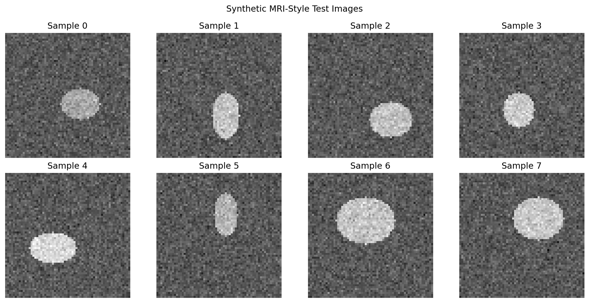
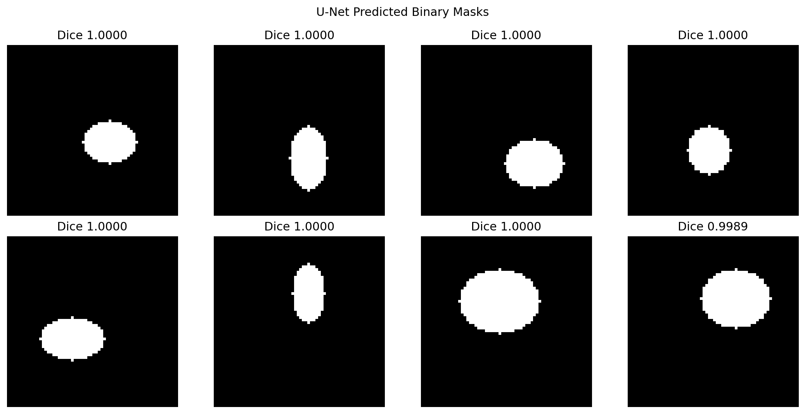
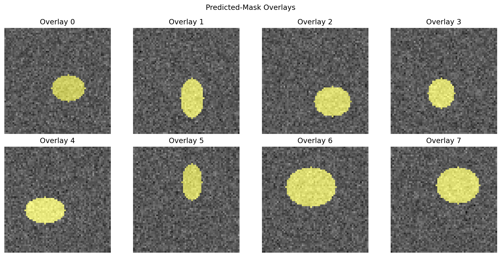
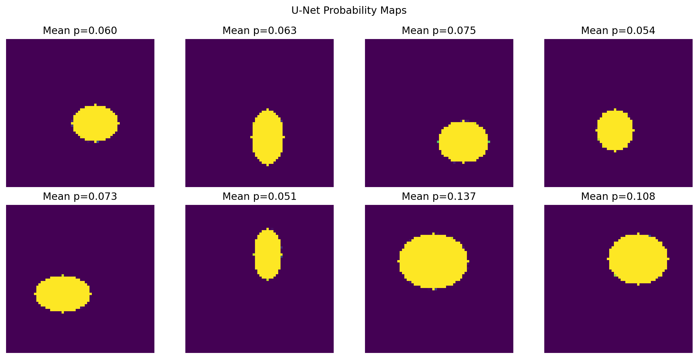
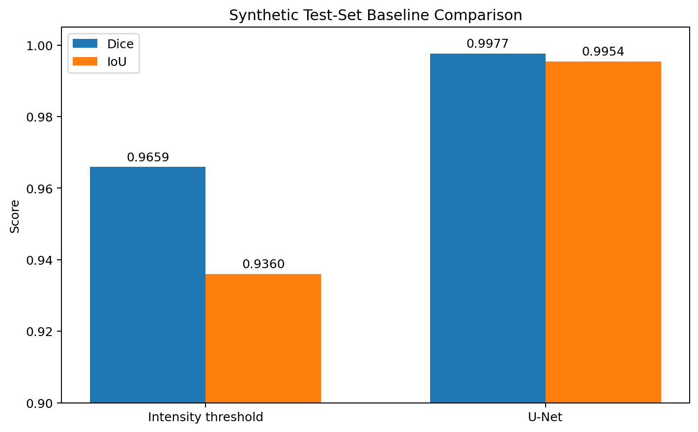
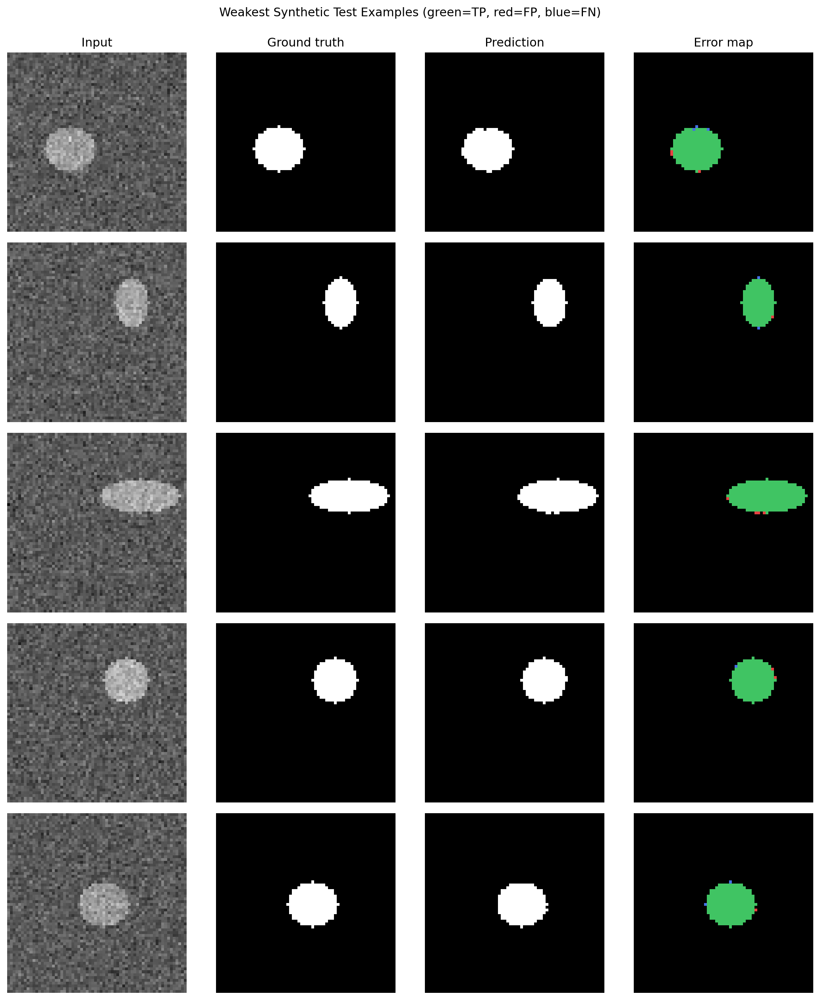

# Medical Image Segmentation using U-Net

[](https://www.tensorflow.org/)
[](https://www.gradio.app/)
[](https://huggingface.co/spaces/YOUR_HF_USERNAME/medical-image-segmentation-unet)
[](LICENSE)

A complete binary image-segmentation portfolio project built from the supplied notebook and trained model. The project demonstrates a compact U-Net, deterministic synthetic data generation, a threshold baseline, segmentation evaluation, error analysis, reusable inference code, and a Gradio application prepared for Hugging Face Spaces.

> [!CAUTION]
> **Medical disclaimer:** This project is for educational and portfolio demonstration purposes only. It is not a medical diagnostic tool. The model must not be used to diagnose, treat, prevent, or manage any medical condition. Medical image interpretation requires clinical validation, domain expertise, and review by qualified healthcare professionals. Do not upload private, sensitive, confidential, or personally identifiable medical images. Predicted masks are machine-learning outputs, not medical advice.

## Executive summary

**Question:** Can a CNN learn to identify a target region at the pixel level and return an aligned segmentation mask?

**Answer for this experiment:** Yes, on the notebook's deterministic synthetic task. The model learned to segment a bright elliptical region from 64×64 grayscale images and outperformed a simple intensity-threshold baseline. This is an engineering proof of concept, not evidence of performance on real medical scans.

## Live demo

- Hugging Face Space: `https://huggingface.co/spaces/YOUR_HF_USERNAME/medical-image-segmentation-unet`
- Training notebook: [`notebooks/image_segmentation_unet_medical_imaging.ipynb`](notebooks/image_segmentation_unet_medical_imaging.ipynb)

Replace `YOUR_HF_USERNAME` after deployment.

## Actual dataset used

The executable notebook creates the dataset in memory. No external clinical or public medical dataset is loaded.

| Property | Value |
|---|---|
| Dataset type | Deterministic synthetic MRI-style grayscale images |
| Number of image-mask pairs | 2,500 |
| Image shape | 64 × 64 × 1 |
| Mask shape | 64 × 64 × 1 |
| Task | Binary semantic segmentation |
| Target | Synthetic elliptical high-intensity region |
| Train / validation / test | 1,750 / 375 / 375 |
| Random seed | 42 |
| Training positive-pixel rate | Approximately 8.45% |
| Patient data | None |

The image generator creates a Gaussian-noise background and adds a brighter ellipse. The aligned mask is `1` inside the ellipse and `0` elsewhere.

## Why the dataset distinction matters

The original notebook's narrative mentioned real modalities and clinical applications, but the implemented experiment is synthetic. The README, app, metadata, and project audit now state this explicitly so the high scores are not misrepresented as clinical performance.

## Workflow

```text
Synthetic grayscale image + aligned mask
                 ↓
70 / 15 / 15 split with seed 42
                 ↓
Intensity-threshold baseline
                 ↓
Compact U-Net training
                 ↓
Probability mask → thresholded binary mask
                 ↓
Dice, IoU, pixel metrics, overlays, error analysis
                 ↓
Gradio inference app on Hugging Face Spaces
```

## Preprocessing

### Images

1. Read a PIL image, NumPy array, or supported file path.
2. Apply EXIF orientation correction.
3. Preserve an RGB copy for display.
4. Convert the model input to grayscale.
5. Resize to 64×64 with bilinear interpolation.
6. Convert to `float32` and divide by 255.
7. Add batch and channel dimensions to produce `(1, 64, 64, 1)`.

### Masks

1. Convert to grayscale.
2. Resize to 64×64 with nearest-neighbor interpolation so labels are not blended.
3. Scale to `[0, 1]`.
4. Binarize at 0.5.
5. Add batch and channel dimensions.

The same image preprocessing is used during local and hosted inference.

## Data augmentation

The supplied trained artifact was produced without an augmentation pipeline in the executable notebook. No augmentation is falsely claimed for the recorded model results.

For a future real-dataset version, use only modality-appropriate paired transformations. Any spatial transformation must be applied identically to the image and mask. Patient orientation and anatomy must be considered before enabling flips or rotations.

## U-Net architecture

The committed artifact is a compact two-level U-Net with **470,977 trainable parameters**.

```text
Input: 64×64×1
  ↓
Conv 32 → Conv 32 ─────────────────────────────┐
  ↓ MaxPool                                    │ skip 1
Conv 64 → Conv 64 ────────────────┐            │
  ↓ MaxPool                       │ skip 2     │
Conv 128 → Conv 128               │            │
  ↓ UpSampling + concatenate ◄────┘            │
Conv 64 → Conv 64                              │
  ↓ UpSampling + concatenate ◄─────────────────┘
Conv 32 → Conv 32
  ↓
1×1 Conv + sigmoid
  ↓
Output: 64×64×1 probability mask
```

### Why U-Net works for segmentation

The encoder learns increasingly abstract visual features while reducing spatial resolution. The decoder reconstructs a pixel-level prediction. Skip connections transfer detailed boundary information from encoder layers to matching decoder layers, improving localization compared with an encoder-decoder that must recover all spatial detail from the bottleneck alone.

## Training setup

| Setting | Value |
|---|---|
| Optimizer | Adam |
| Learning rate | 0.001 |
| Loss | Binary cross-entropy |
| Metrics | Soft Dice and soft IoU |
| Batch size | 32 |
| Maximum epochs | 15 |
| Early stopping | Validation Dice, patience 4 |
| LR reduction | Validation loss, factor 0.5, patience 2 |
| Output activation | Sigmoid |

## Results

### Baseline comparison

| Approach | Test Dice | Test IoU | Interpretation |
|---|---:|---:|---|
| Intensity threshold at 0.55 | 0.9659 | 0.9360 | Strong because the synthetic target is deliberately brighter than the background |
| U-Net | 0.9977 | 0.9954 | Learns a smoother, more precise pixel-level decision boundary |

Additional thresholded-mask statistics at 0.5:

- mean hard-mask Dice: 0.9990
- mean hard-mask IoU: 0.9980
- pixel accuracy: 0.99984
- false-positive pixel rate: 0.0000931
- false-negative pixel rate: 0.0000664

> These values apply only to the deterministic synthetic test split. Pixel accuracy is reported for completeness but is less informative than overlap metrics when background pixels dominate.

### Metric interpretation

- **Dice coefficient:** overlap between predicted and true foreground, emphasizing agreement on the target region.
- **IoU / Jaccard index:** intersection divided by union; stricter than Dice for the same masks.
- **Precision:** how much of the predicted foreground is correct.
- **Recall:** how much of the true foreground is recovered.
- **Pixel accuracy:** fraction of all pixels classified correctly; potentially inflated by large background regions.
- **Overlay and error map:** visual checks for boundary errors, false positives, and missed foreground.

## Visual results

| Input samples | Predicted masks |
|---|---|
|  |  |

| Overlays | Probability maps |
|---|---|
|  |  |

| Baseline comparison | Weak examples and error maps |
|---|---|
|  |  |

## Error analysis

The weakest synthetic examples still score highly, but the remaining errors are concentrated around ellipse boundaries and low-contrast pixels. False positives can appear immediately outside the target edge; false negatives can appear inside edge pixels where interpolation and the learned probability transition interact.

This analysis should not be generalized to real medical failure modes. A clinically meaningful error study would need real, independently annotated scans, patient-level splits, subgroup analysis, acquisition-site analysis, and qualified domain review.

## Gradio demo outputs

The app returns:

- original uploaded image
- binary predicted mask
- red mask overlay
- probability heatmap
- selected threshold
- predicted-region percentage
- optional Dice and IoU when a matching ground-truth mask is uploaded
- downloadable PNG mask
- prominent medical disclaimer

The app loads `models/unet_medical.keras` directly and never trains at startup.

## Local installation

### Windows PowerShell

```powershell
cd 01-image-segmentation-unet-medical-imaging
python -m venv .venv
.venv\Scripts\Activate.ps1
python -m pip install --upgrade pip
pip install -r requirements.txt
python app.py
```

### macOS/Linux

```bash
cd 01-image-segmentation-unet-medical-imaging
python3 -m venv .venv
source .venv/bin/activate
python -m pip install --upgrade pip
pip install -r requirements.txt
python app.py
```

Open `http://127.0.0.1:7860`.

Convenience launchers are also provided:

```text
run_local.bat
run_local.sh
```

## Training and evaluation

The committed model already supports inference. Training is optional.

```bash
pip install -r requirements-training.txt
python scripts/train_model.py
python scripts/evaluate_model.py
python scripts/smoke_test.py
pytest -q
```

Training regenerates the deterministic synthetic dataset and can overwrite the model artifact. Preserve the supplied artifact before retraining if you want to retain the recorded results.

## Hugging Face Spaces deployment

1. Create a new Space.
2. Select the Gradio SDK and CPU Basic hardware.
3. Upload the **contents** of this folder to the Space root.
4. Confirm that `app.py`, `requirements.txt`, `README.md`, `models/`, `src/`, and `data/` are at the top level.
5. Wait for the automatic build.
6. Test a safe synthetic example.
7. Add the final Space URL to this README and the root repository README.

See [`README_HOSTING.md`](README_HOSTING.md) for browser, Git, CLI, troubleshooting, and final-link instructions.

## Docker

```bash
docker build -t medical-unet-demo .
docker run --rm -p 7860:7860 medical-unet-demo
```

## Project structure

```text
01-image-segmentation-unet-medical-imaging/
├── app.py
├── gradio_app.py
├── archive/
├── data/
│   ├── sample_images/
│   ├── sample_masks/
│   ├── sample_manifest.csv
│   └── README_data.md
├── images/
├── models/
│   ├── unet_medical.keras
│   ├── metrics.json
│   └── model_metadata.json
├── notebooks/
│   └── image_segmentation_unet_medical_imaging.ipynb
├── outputs/
├── scripts/
├── src/
├── tests/
├── Dockerfile
├── requirements.txt
├── requirements-training.txt
├── requirements-dev.txt
├── README_HUGGINGFACE.md
├── README_HOSTING.md
├── PROJECT_AUDIT.md
├── IMPROVEMENTS.md
├── MONOREPO_INTEGRATION.md
└── FILE_MANIFEST.csv
```

## Skills demonstrated

- CNN-based semantic segmentation
- U-Net architecture and skip connections
- image and mask preprocessing
- deterministic dataset generation
- baseline design
- Dice, IoU, precision, recall, and pixel analysis
- threshold tuning and error analysis
- model artifact packaging
- Gradio application development
- Hugging Face Spaces deployment
- pytest, GitHub Actions, and Docker
- responsible communication of medical-AI limitations

## Portfolio positioning

**One-line description**

> Built and deployed a compact U-Net pipeline for binary pixel-level segmentation, including deterministic data generation, baseline comparison, Dice/IoU evaluation, visual error analysis, and a Hugging Face Spaces Gradio demo.

**Pinned-project description**

> End-to-end U-Net segmentation project with modular TensorFlow inference, safe synthetic medical-style demo data, overlap metrics, overlays, tests, CI, Docker, and Hugging Face Spaces deployment.

This work connects naturally to a Quality Data Scientist background because semantic segmentation is directly relevant to defect localization, surface inspection, automated region measurement, visual quality checks, and image-based process analytics. The current synthetic medical-style experiment demonstrates the technical pattern; a production quality-inspection version would require domain-specific data and validation.

## Future improvements

- train on a properly licensed and de-identified public dataset
- split by patient or study to reduce leakage
- compare BCE, Dice loss, focal loss, and combined objectives
- add paired, modality-appropriate augmentation
- test deeper U-Net and pretrained encoders
- add calibration, uncertainty estimation, and out-of-distribution checks
- export TensorFlow Lite or ONNX for lighter deployment
- add clinical or manufacturing-domain review appropriate to the chosen dataset

## License

MIT License. Dataset-specific licenses must be followed separately when the project is extended beyond the bundled synthetic examples.
