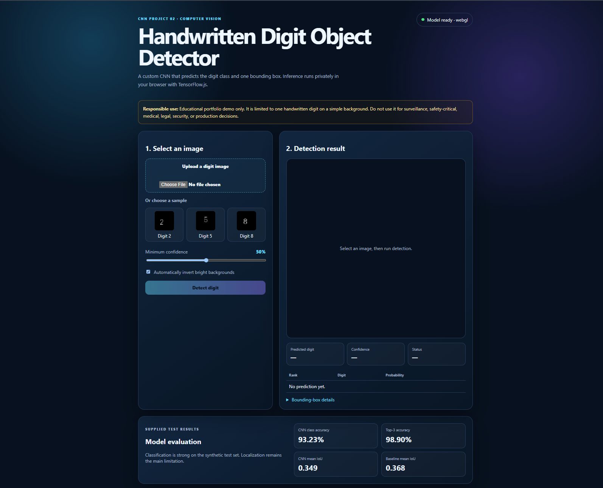
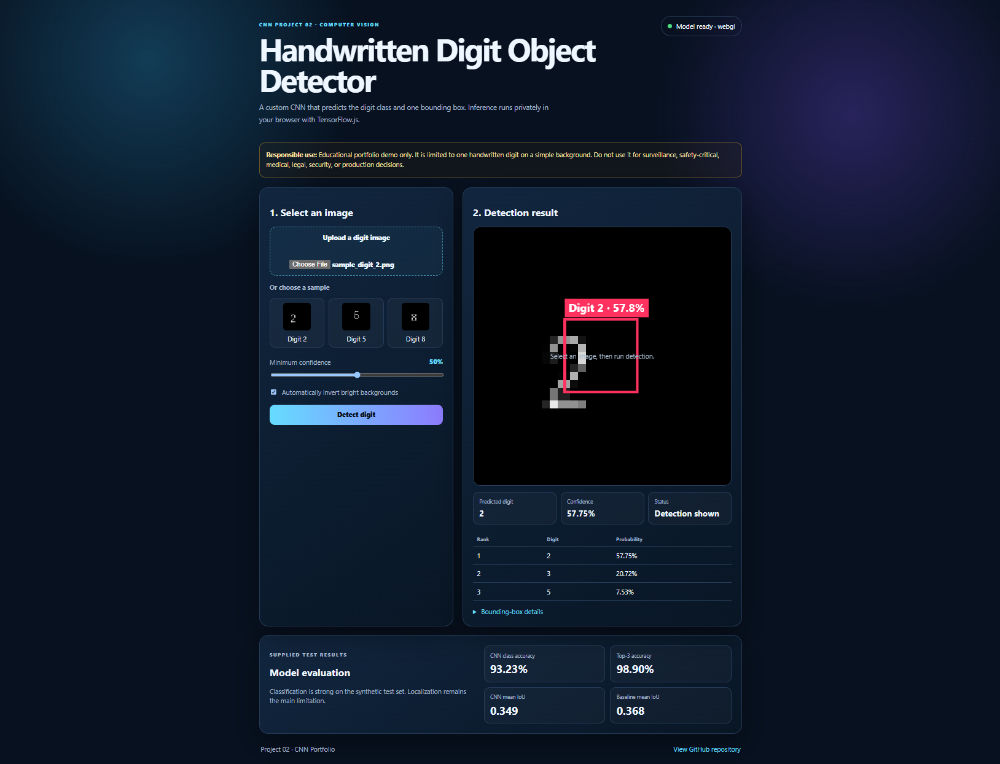

# Object Detection using CNN

[](https://www.python.org/)
[](https://www.tensorflow.org/)
[](https://www.tensorflow.org/js)
[](https://cnn-object-detection.vercel.app/)
[](https://github.com/unit-mole/cnn-projects/actions/workflows/02-object-detection-using-cnn.yml)
[](LICENSE)

An end-to-end computer vision project that uses a custom Convolutional Neural Network (CNN) to classify a handwritten digit and predict its bounding box. The project includes synthetic object-detection data generation, image preprocessing, CNN-based feature extraction, multi-output prediction, IoU evaluation, browser-based inference with TensorFlow.js, and deployment as a responsive Vercel application.

**Status:** Portfolio-ready, CI-tested, and deployed  
**Live demo:** [Open the CNN Object Detection application](https://cnn-object-detection.vercel.app/)  
**Source repository:** https://github.com/unit-mole/cnn-projects  
**Primary stack:** Python · TensorFlow · Keras · CNN · TensorFlow.js · JavaScript · HTML · CSS · Vercel

---

## Responsible Use

This project is for educational and portfolio demonstration purposes only.

- The model may classify a digit incorrectly or produce an inaccurate bounding box.
- It is designed for one handwritten digit on a simple background and is not a general-purpose object detector.
- It should not be used as the sole basis for surveillance, safety-critical monitoring, autonomous driving, medical decisions, security decisions, legal decisions, or production inspection workflows.
- Do not upload private, confidential, copyrighted, or personally identifiable images.
- Predictions should be interpreted as machine-learning outputs rather than guaranteed truth.

---

## Business Problem

Visual inspection systems often need to identify an object and determine where it appears inside an image.

This project answers:

> Given an image containing one handwritten digit, can a CNN identify the digit and estimate its bounding-box location?

The deployed application returns:

- Predicted digit class
- Prediction confidence
- Normalized bounding-box coordinates
- Annotated image
- Top-three class probabilities
- Detection status based on the selected confidence threshold
- Responsible-use note

---

## Project Objective

Build a portfolio-ready computer vision solution that can:

1. Generate a synthetic object-detection dataset from MNIST images.
2. Place one handwritten digit at a random position on a larger canvas.
3. Preserve the image-label-bounding-box relationship.
4. Normalize image pixels and bounding-box coordinates.
5. Train a CNN with classification and bounding-box regression outputs.
6. Evaluate class prediction and localization performance.
7. Save and reload the trained Keras model.
8. Convert the trained model weights for browser inference.
9. Run predictions directly in the browser using TensorFlow.js.
10. Deploy the application as a responsive Vercel website.

---

## Dataset

The project uses the MNIST handwritten-digit dataset as the source data.

For the object-detection version:

- Each MNIST digit is placed on a synthetic `64 × 64` grayscale canvas.
- The digit is randomly resized and positioned.
- Each generated image contains one object.
- The object class is one of the digits `0–9`.
- Each image has one normalized bounding box in `[x1, y1, x2, y2]` format.
- The complete generated dataset is created programmatically and is not redistributed in GitHub.
- Safe sample images are included for application testing.

| Dataset Component | Description |
|---|---|
| Source images | MNIST handwritten digits |
| Input size | `64 × 64 × 1` |
| Number of classes | 10 |
| Class labels | Digits `0–9` |
| Objects per image | One |
| Bounding-box format | Normalized `XYXY` |
| Color mode | Grayscale |
| Pixel normalization | Values scaled to `[0, 1]` |

---

## Tools and Technologies

| Area | Technology |
|---|---|
| Programming | Python, JavaScript |
| Deep learning | TensorFlow, Keras |
| Browser inference | TensorFlow.js |
| Computer vision | CNN feature extraction, bounding-box regression |
| Data processing | NumPy, pandas |
| Image handling | Pillow, HTML Canvas API |
| Evaluation | Accuracy, Top-3 Accuracy, IoU |
| Frontend | HTML, CSS, JavaScript |
| Testing / quality | pytest, compile checks, JavaScript validation |
| Hosting | Vercel |
| CI/CD | GitHub Actions |

---

## Project Workflow

```text
MNIST digit images
        │
        ▼
Digit normalization
        │
        ▼
Random resizing and placement
        │
        ▼
Synthetic 64 × 64 canvas generation
        │
        ▼
Class label and bounding-box creation
        │
        ▼
Train / validation / test split
        │
        ▼
CNN feature extraction
        │
        ├───────────────┐
        ▼               ▼
Class prediction   Bounding-box regression
        │               │
        └───────┬───────┘
                ▼
Model evaluation
                │
                ▼
Saved Keras model
                │
                ▼
Browser-compatible weight conversion
                │
                ▼
TensorFlow.js inference
                │
                ▼
Vercel deployment
```

---

## Image Preprocessing

The preprocessing pipeline performs:

- Image loading
- Grayscale conversion
- EXIF orientation handling
- Image resizing to `64 × 64`
- Pixel normalization to `[0, 1]`
- Batch-dimension creation
- Optional inversion for bright backgrounds
- Validation of input shape and data type
- Error handling for unsupported images

The same image dimensions and normalization rules are used during training and browser inference.

---

## Bounding-Box Preprocessing

Each generated training sample contains one normalized bounding box:

```text
[x1, y1, x2, y2]
```

The project includes utilities for:

- Bounding-box clipping
- Coordinate ordering
- Invalid-value handling
- Normalized-to-pixel conversion
- Box-area calculation
- Intersection over Union calculation
- Keeping the predicted box inside image boundaries

Non-Maximum Suppression is not required because the model predicts exactly one object and one bounding box per image.

---

## CNN Architecture

```text
64 × 64 × 1 grayscale input
          ↓
Conv2D (32 filters, ReLU)
          ↓
MaxPooling2D
          ↓
Conv2D (64 filters, ReLU)
          ↓
MaxPooling2D
          ↓
Conv2D (128 filters, ReLU)
          ↓
Global Average Pooling
          ↓
Dense layer (128 units, ReLU)
          ↓
Dropout
          ↓
Shared CNN feature representation
          │
          ├───────────────────────────┐
          ▼                           ▼
10-class Softmax output       4-value Sigmoid output
Digit classification          Bounding-box regression
```

Training uses:

- Categorical cross-entropy for class prediction
- Mean squared error for bounding-box regression
- Adam optimizer
- Early stopping
- Validation monitoring
- Learning-rate reduction

---

## Why This Is Object Detection

Image classification predicts **what** object appears in an image.

Object detection predicts:

1. **What** object appears.
2. **Where** the object is located.

In this project:

- The classification head predicts the handwritten digit.
- The regression head predicts the bounding-box coordinates.
- The annotated output displays the predicted class, confidence score, and localized region.

This is a custom educational single-object detector rather than a YOLO, SSD, or Faster R-CNN implementation.

---

## Model Results

| Model / Approach | Class Accuracy | Mean IoU | Top-3 Accuracy |
|---|---:|---:|---:|
| Fixed-box baseline | 17.70% | **0.368** | — |
| CNN object detector | **93.23%** | 0.349 | **98.90%** |

The CNN provides a major improvement in class recognition.

The localization result is reported transparently: the CNN mean IoU is slightly below the fixed center-box baseline. This indicates that bounding-box localization remains the main area for future improvement.

---

## Evaluation Metrics

### Classification Accuracy

Measures how often the predicted digit matches the true digit.

### Top-3 Accuracy

Measures whether the true digit appears among the model's three most likely predictions.

### Intersection over Union

IoU measures the overlap between the predicted and true bounding boxes.

```text
IoU = Area of Intersection / Area of Union
```

A higher IoU indicates better localization.

### Confidence Threshold

The deployed application allows the user to adjust the minimum prediction confidence. A detection box is shown only when the predicted class confidence meets or exceeds the selected threshold.

---

## Error Analysis

The model generally performs best when:

- One handwritten digit is visible.
- The digit has strong contrast.
- The image resembles the synthetic MNIST training distribution.
- The background is simple.
- The digit occupies a meaningful portion of the image.

Weak predictions may occur when:

- Multiple digits are present.
- The image contains natural-scene objects.
- The handwriting is highly unusual.
- The digit is extremely small or cropped.
- The background contains significant visual noise.
- The image differs strongly from the training distribution.
- Classification confidence is high but localization is inaccurate.

A high class confidence does not guarantee a high-quality bounding box.

---

## Vercel + TensorFlow.js Demo

The deployed application supports:

- Image upload
- Safe sample images
- Browser-based model loading
- Client-side image preprocessing
- Confidence-threshold adjustment
- Automatic bright-background inversion
- Digit prediction
- Bounding-box visualization
- Top-three class probabilities
- Bounding-box coordinate display
- Model evaluation summary
- Responsive desktop and mobile layout
- Responsible-use guidance

### Application Overview



### CNN Detection Result



---

## Browser Inference Architecture

Unlike a Python server application, the deployed Vercel version performs inference directly in the browser.

```text
User image
    │
    ▼
JavaScript image preprocessing
    │
    ▼
TensorFlow.js CNN
    │
    ├── Digit probabilities
    └── Bounding-box coordinates
    │
    ▼
HTML Canvas annotation
```

The deployed website uses:

| File | Purpose |
|---|---|
| `index.html` | Application structure |
| `style.css` | Responsive user-interface styling |
| `app.js` | Preprocessing, model reconstruction, inference, and visualization |
| `web_model/weights.bin` | Converted CNN weights |
| `web_model/weights-manifest.json` | Weight names, shapes, offsets, and types |
| `vercel.json` | Vercel deployment configuration |

The uploaded image remains in the user's browser and is not sent to an inference server.

---

## Model Artifacts

| Artifact | Purpose |
|---|---|
| `models/cnn_detector.keras` | Original trained TensorFlow/Keras model |
| `models/model_metadata.json` | Input shape, class mapping, preprocessing, and model scope |
| `models/metrics.json` | Saved evaluation metrics |
| `web_model/weights.bin` | Browser-readable model weights |
| `web_model/weights-manifest.json` | TensorFlow.js weight metadata |
| `notebooks/object_detection_using_cnn.ipynb` | Original training and evaluation workflow |

---

## Run Locally

### 1. Open the project

```bash
cd cnn-projects/02-object-detection-using-cnn
```

### 2. Launch the Vercel website locally

```bash
python -m http.server 8000
```

Open:

```text
http://localhost:8000
```

Do not open `index.html` directly using a `file://` path because the browser may block model-file requests.

### 3. Validate the static application

```bash
npm run check
node --check app.js
```

### 4. Run the Python tests

Create a virtual environment.

**Windows**

```bat
py -3.11 -m venv .venv
.venv\Scripts\activate
```

**macOS / Linux**

```bash
python3.11 -m venv .venv
source .venv/bin/activate
```

Install the development dependencies:

```bash
python -m pip install --upgrade pip
python -m pip install -r requirements-dev.txt
```

Run validation:

```bash
python -m pytest -q
python -m compileall app.py gradio_app.py src scripts tests
```

---

## Deploy on Vercel

- **Repository:** `unit-mole/cnn-projects`
- **Branch:** `main`
- **Root directory:** `02-object-detection-using-cnn`
- **Framework preset:** `Other`
- **Build command:** Leave empty
- **Output directory:** Leave empty
- **Install command:** Leave empty
- **Live application:** https://cnn-object-detection.vercel.app/

The Vercel project is connected to GitHub. New commits affecting the project can trigger updated deployments automatically.

See `README_VERCEL.md` for deployment-specific instructions.

---

## Project Structure

```text
cnn-projects/
└── 02-object-detection-using-cnn/
    ├── data/
    │   ├── sample_images/
    │   └── sample_annotations/
    ├── images/
    │   ├── 01-vercel-app-overview.png
    │   └── 02-cnn-detection-result.png
    ├── models/
    │   ├── cnn_detector.keras
    │   ├── metrics.json
    │   └── model_metadata.json
    ├── notebooks/
    │   └── object_detection_using_cnn.ipynb
    ├── outputs/
    ├── scripts/
    ├── src/
    ├── tests/
    ├── web_model/
    │   ├── weights.bin
    │   └── weights-manifest.json
    ├── app.js
    ├── app.py
    ├── index.html
    ├── package.json
    ├── README.md
    ├── README_VERCEL.md
    ├── requirements.txt
    ├── style.css
    └── vercel.json
```

---

## Future Improvements

- Replace mean squared error with IoU-aware localization loss.
- Add GIoU, DIoU, or CIoU loss.
- Preserve more spatial information instead of relying only on global average pooling.
- Improve bounding-box localization through broader augmentation.
- Add rotation, translation, scale, and contrast augmentation.
- Evaluate IoU across multiple thresholds.
- Add precision, recall, and average-precision metrics.
- Extend the model to support multiple objects.
- Add objectness prediction and Non-Maximum Suppression.
- Compare with a lightweight pretrained detector.
- Support additional handwritten symbols and image classes.
- Add browser-side download of the annotated image.

---

## Skills Demonstrated

- Computer Vision
- Convolutional Neural Networks
- Object Detection
- Image Preprocessing
- Synthetic Dataset Generation
- Bounding-Box Regression
- Multi-output Neural Networks
- TensorFlow and Keras
- TensorFlow.js
- Browser-based Machine Learning
- JavaScript Inference Pipelines
- IoU Evaluation
- Error Analysis
- Responsible AI Communication
- Vercel Deployment
- Responsive Web Development
- GitHub Actions
- Testing and ML Engineering

---

## Portfolio Positioning

**One-line description:** Custom CNN-based object-detection system that classifies handwritten digits, predicts bounding boxes, and performs private browser inference through TensorFlow.js on Vercel.

**Pinned repository description:** End-to-end computer vision project featuring synthetic detection-data generation, CNN classification and bounding-box regression, IoU evaluation, TensorFlow.js browser inference, responsible AI framing, and Vercel deployment.

This project demonstrates the transition from Quality Data Science into broader Data Science, Machine Learning, Applied AI, Computer Vision, Image Analytics, and Quality Analytics roles.

The project is particularly relevant to image-based quality workflows because the same core pattern—identifying an item and localizing a region of interest—supports:

- Visual inspection
- Defect localization
- Product inspection
- Automated quality checks
- Anomaly localization
- Measurement automation
- Inspection analytics

---

## Author

**Anmol Tripathi**

Quality Data Scientist transitioning toward Data Science, Machine Learning, Applied AI, Computer Vision, Analytics Engineering, Image Analytics, and Quality Analytics roles.
