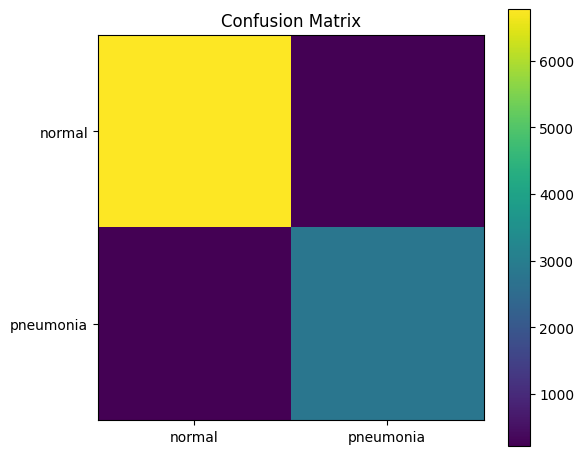
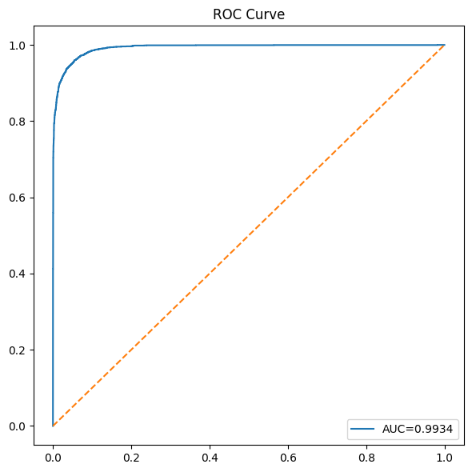
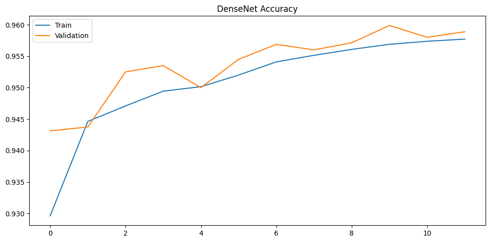
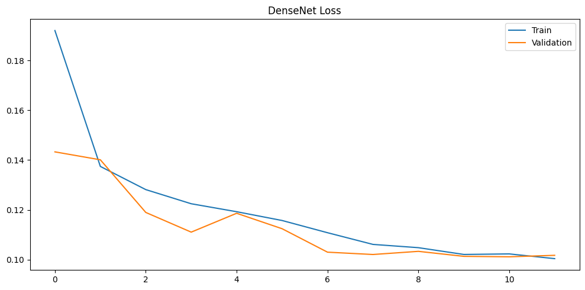
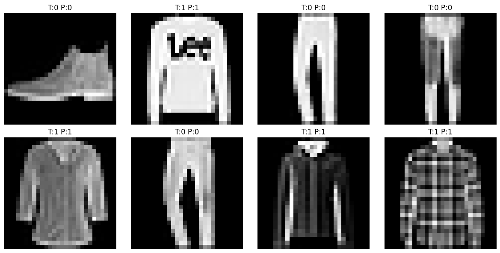
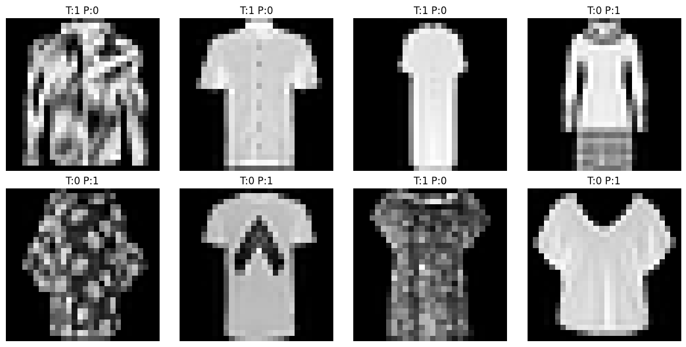
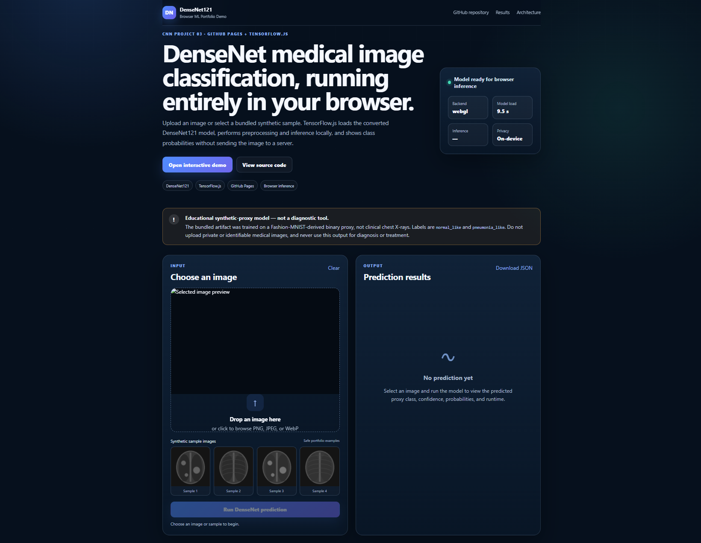
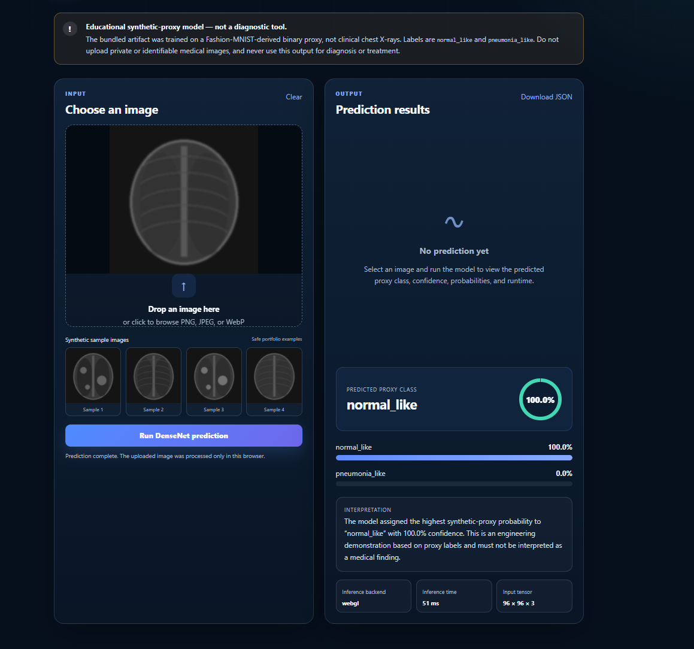
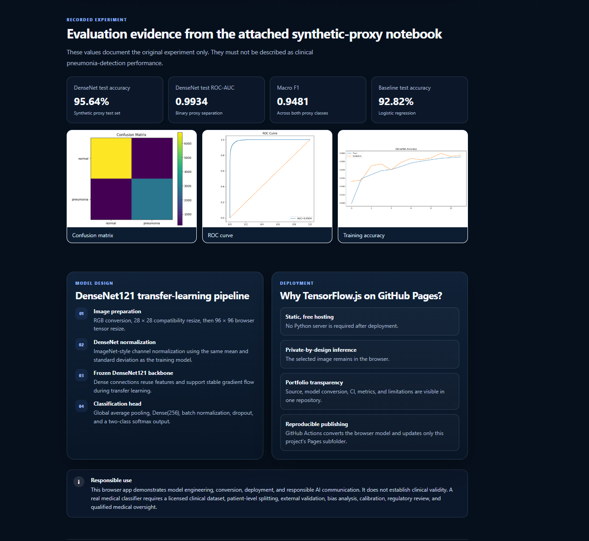

# DenseNet121 Medical-Style Image Classification

[](https://www.python.org/)
[](https://www.tensorflow.org/)
[](https://keras.io/api/applications/densenet/)
[](https://www.tensorflow.org/js)
[]([https://unit-mole.github.io/cnn-projects/03-densenet-medical-image-classification/](https://unit-mole.github.io/cnn-projects/03-densenet-medical-image-classification/))
[](https://github.com/unit-mole/cnn-projects/actions/workflows/03-densenet-medical-image-classification.yml)
[](LICENSE)

An end-to-end computer vision portfolio project that uses a **DenseNet121 convolutional neural network** for binary image classification. The repository includes reproducible image preprocessing, transfer learning, baseline comparison, model evaluation, error-analysis outputs, saved artifacts, a Kaggle-ready training workflow, and a fully interactive **TensorFlow.js application deployed through GitHub Pages**.

**Status:** Portfolio-ready and deployed  
**Live demo:** [Open the DenseNet121 browser application](https://unit-mole.github.io/cnn-projects/03-densenet-medical-image-classification/)  
**Deployment:** GitHub Pages + TensorFlow.js  
**Primary stack:** Python · TensorFlow · Keras · DenseNet121 · TensorFlow.js · JavaScript · GitHub Actions

---

## Responsible Use and Artifact Disclosure

This project is for educational, engineering, and portfolio demonstration purposes only.

- It is **not a medical diagnostic tool**.
- It must not be used to diagnose, treat, prevent, or manage any medical condition.
- Do not upload private, sensitive, confidential, or personally identifiable medical images.
- Predictions are machine-learning outputs and must not be interpreted as medical advice.
- Medical-image interpretation requires clinical validation, domain expertise, and review by qualified healthcare professionals.

### Important dataset audit

The original notebook narrative describes chest X-ray pneumonia detection, but the executable training cells use a **Fashion-MNIST-derived synthetic binary proxy dataset**. The bundled model therefore predicts these proxy labels:

| Class | Meaning in this portfolio artifact |
|---|---|
| `normal_like` | Synthetic negative proxy class |
| `pneumonia_like` | Synthetic positive proxy class |

The recorded metrics in this repository apply only to this proxy experiment. They must not be presented as clinical pneumonia-detection performance.

A separate Kaggle-ready notebook is included for responsible retraining on a properly licensed and documented chest X-ray dataset.

---

## Business Problem

Image-based inspection workflows often require rapid and consistent classification of visual inputs. Manual review can be slow, subjective, and difficult to scale.

This project answers:

> Given an input image, can a DenseNet121 transfer-learning model assign it to the most likely synthetic proxy class and return transparent probability-based results directly in the browser?

The deployed pipeline returns:

- Predicted proxy class
- Confidence score
- Probability for each class
- Browser inference backend
- Model inference time
- Plain-language interpretation
- Downloadable prediction summary
- Responsible-use warning

The same engineering pattern can be adapted to real-world visual inspection, defect classification, product-image review, anomaly triage, and validated medical-imaging research after appropriate data and domain validation.

---

## Project Objective

Build a portfolio-ready computer vision solution that can:

1. Validate and preprocess image inputs consistently.
2. Convert grayscale-style inputs into RGB tensors.
3. Apply DenseNet-compatible resizing and normalization.
4. Use DenseNet121 as a transfer-learning feature extractor.
5. Compare the deep-learning model with a classical baseline.
6. Evaluate performance beyond accuracy.
7. Report class probabilities and confidence scores.
8. Save and reload model and metadata artifacts.
9. Convert the trained Keras model into TensorFlow.js format.
10. Run inference entirely inside the user's browser.
11. Deploy automatically through GitHub Actions and GitHub Pages.
12. Communicate limitations and responsible-use boundaries clearly.

---

## Dataset

The bundled portfolio artifact uses a **Fashion-MNIST-derived synthetic proxy dataset**.

### Dataset construction

Original Fashion-MNIST source classes `2`, `4`, and `6` are mapped to the synthetic positive class, while the remaining source classes are mapped to the synthetic negative class.

| Split | Number of images |
|---|---:|
| Training | 52,000 |
| Validation | 8,000 |
| Test | 10,000 |

### Training class distribution

| Class | Count | Approximate share |
|---|---:|---:|
| `normal_like` | 36,419 | 70.0% |
| `pneumonia_like` | 15,581 | 30.0% |

### Test class distribution

| Class | Count |
|---|---:|
| `normal_like` | 7,000 |
| `pneumonia_like` | 3,000 |

Only safe synthetic sample images are included in the public website. No private patient data or protected health information is included.

---

## Tools and Technologies

| Area | Technology |
|---|---|
| Language | Python 3.12, JavaScript |
| Deep learning | TensorFlow, Keras |
| CNN architecture | DenseNet121 |
| Transfer learning | ImageNet-initialized DenseNet backbone |
| Data processing | NumPy, pandas |
| Evaluation | scikit-learn, Matplotlib |
| Browser inference | TensorFlow.js |
| Web interface | HTML, CSS, JavaScript |
| Hosting | GitHub Pages |
| CI/CD | GitHub Actions |
| Model persistence | `.keras`, `.h5`, TensorFlow.js `model.json` and weight shards |
| Testing / quality | pytest, compile checks, static-site validation |
| Reproducible training | Kaggle Notebook |
| Optional local demo | Gradio |
| Containerization | Docker |

---

## Project Workflow

```text
Synthetic image dataset
        │
        ▼
Dataset validation and class mapping
        │
        ▼
RGB channel conversion
        │
        ▼
Train / validation / test preparation
        │
        ▼
Pixel scaling to [0, 1]
        │
        ▼
Safe image augmentation
        │
        ▼
DenseNet121 transfer-learning model
        │
        ▼
Baseline comparison and evaluation
        │
        ▼
Saved Keras model and metadata
        │
        ▼
Inference-only browser model preparation
        │
        ▼
Keras-to-TensorFlow.js conversion
        │
        ▼
GitHub Actions deployment
        │
        ▼
GitHub Pages browser application
```

---

## Image Preprocessing

The project uses a consistent preprocessing pipeline for training and inference:

- Image validation and unsupported-file handling
- Conversion to RGB
- External compatibility resize to `28 × 28`
- Conversion to `float32`
- Pixel scaling to `[0, 1]`
- Internal resize to `96 × 96`
- DenseNet/ImageNet channel preprocessing
- Batch-dimension creation
- Softmax probability output

The saved model metadata records:

- Input image shape
- Internal DenseNet resize
- Color mode
- Class mapping
- Preprocessing method
- Dataset status
- Model limitations
- Evaluation metrics

---

## Data Augmentation

The attached proxy experiment uses limited augmentation:

- Horizontal flipping
- Small rotations
- Minor zooming

These transformations support generalization for the synthetic proxy task. For a real medical-image dataset, every augmentation must be reviewed for anatomical and clinical appropriateness before use.

---

## DenseNet121 Architecture

```text
Input image: 28 × 28 × 3
        ↓
Internal resize: 96 × 96 × 3
        ↓
Training-only augmentation
        ↓
DenseNet preprocessing
        ↓
DenseNet121 backbone
ImageNet initialization
Frozen feature extractor
        ↓
Global Average Pooling
        ↓
Dense layer: 256 units, ReLU
        ↓
Batch Normalization
        ↓
Dropout: 0.5
        ↓
Dense layer: 2 units
        ↓
Softmax class probabilities
```

DenseNet connects each layer to feature maps produced by earlier layers. These dense connections improve feature reuse and gradient flow, making DenseNet a strong transfer-learning architecture for image-classification experiments.

### Training configuration

- Categorical cross-entropy loss
- Adam optimizer
- Requested training epochs: 12
- Batch size: 128
- Frozen DenseNet121 backbone
- Accuracy and ROC-AUC monitoring
- Reproducibility seed: 42

---

## Model Results

### Baseline comparison

| Model | Validation Accuracy | Test Accuracy | Test ROC-AUC |
|---|---:|---:|---:|
| Logistic Regression baseline | 93.13% | 92.82% | 0.9740 |
| DenseNet121 | **95.99%** | **95.64%** | **0.9934** |

The DenseNet121 model improved test accuracy by approximately **2.82 percentage points** over the logistic-regression baseline.

### DenseNet121 classification metrics

| Class / Average | Precision | Recall | F1-score | Support |
|---|---:|---:|---:|---:|
| `normal_like` | 0.9694 | 0.9683 | 0.9688 | 7,000 |
| `pneumonia_like` | 0.9262 | 0.9287 | 0.9274 | 3,000 |
| Macro average | 0.9478 | 0.9485 | 0.9481 | 10,000 |
| Weighted average | 0.9564 | 0.9564 | 0.9564 | 10,000 |

These results apply only to the synthetic proxy dataset.

---

## Class Imbalance

The proxy dataset contains approximately 70% `normal_like` samples and 30% `pneumonia_like` samples.

The project evaluates this imbalance using:

- Per-class precision
- Per-class recall
- Per-class F1-score
- Macro F1-score
- Weighted F1-score
- Confusion matrix
- ROC-AUC
- Error-analysis examples

The separate Kaggle retraining workflow also supports class-weight calculation for a real folder-based image dataset.

Important error types include:

- **False positive:** an image assigned to the positive proxy class incorrectly.
- **False negative:** an image assigned to the negative proxy class incorrectly.
- **Low-confidence prediction:** probabilities are distributed closely between classes.
- **High-confidence error:** the model is incorrect despite reporting high confidence.

---

## Visual Results

| Confusion Matrix | ROC Curve |
|---|---|
|  |  |

| Training Accuracy | Training Loss |
|---|---|
|  |  |

| Correct Predictions | Misclassified Predictions |
|---|---|
|  |  |

---

## GitHub Pages and TensorFlow.js Demo

The deployed application runs the model directly in the browser. The selected image is processed locally and is not uploaded to a Python inference server.

### Application features

- Image upload and drag-and-drop
- Safe bundled sample images
- Client-side preprocessing
- TensorFlow.js model loading
- WebGL inference with CPU fallback
- Predicted proxy class
- Confidence score
- Per-class probability bars
- Inference backend reporting
- Inference-time reporting
- Downloadable prediction JSON
- Model metrics and architecture information
- Dataset-audit disclosure
- Responsible-use limitations

### Live Application Homepage



The landing page introduces the DenseNet121 browser application, deployment stack, model status, safe sample images, and responsible-use disclosure.

### Example Prediction Result



The prediction dashboard displays the selected image, predicted proxy class, confidence score, class probabilities, runtime information, and model interpretation.

### Model Metrics and Limitations



The application presents recorded evaluation metrics, architecture details, dataset limitations, and responsible-use guidance.

---

## Browser Inference Pipeline

```text
Uploaded or selected image
        ↓
Browser-only image decoding
        ↓
RGB conversion and aspect-ratio-safe resize
        ↓
TensorFlow.js tensor preparation
        ↓
DenseNet-compatible normalization
        ↓
Converted DenseNet121 model
        ↓
Two-class softmax prediction
        ↓
Class, confidence, probabilities, runtime, and JSON export
```

No Python server is required after the website has been deployed.

---

## Model Artifacts

| Artifact | Purpose |
|---|---|
| `models/densenet121_medical.keras` | Original audited Keras model |
| `models/densenet121_medical_browser.h5` | Inference-only model prepared for TensorFlow.js conversion |
| `models/model_metadata.json` | Architecture, preprocessing, labels, dataset audit, and limitations |
| `models/metrics.json` | Recorded baseline and DenseNet evaluation metrics |
| `models/label_encoder.pkl` | Saved class-label mapping |
| `web/model/model.json` | TensorFlow.js model topology generated during deployment |
| `web/model/*.bin` | TensorFlow.js weight shards generated during deployment |

The TensorFlow.js files are generated by GitHub Actions and published to the `gh-pages` branch.

---

## Run Locally

### 1. Open the project

```bash
cd cnn-projects/03-densenet-medical-image-classification
```

### 2. Create a virtual environment

**Windows**

```bat
py -3.12 -m venv .venv-pages
.venv-pages\Scripts\activate
```

**macOS / Linux**

```bash
python3.12 -m venv .venv-pages
source .venv-pages/bin/activate
```

### 3. Install browser-deployment dependencies

```bash
python -m pip install --upgrade pip
python -m pip install -r requirements-pages.txt
```

### 4. Convert the browser model

```bash
python scripts/convert_browser_model.py
```

This creates the TensorFlow.js model files under:

```text
web/model/
```

### 5. Start the local website

```bash
python -m http.server 8000 --directory web
```

Open:

```text
http://localhost:8000
```

Do not open `web/index.html` directly through a `file://` URL because browsers may block model-file requests.

---

## Run Tests

Install the CI requirements:

```bash
python -m pip install -r requirements-ci.txt
```

Run:

```bash
python -m pytest -q
python -m compileall src scripts tests
python scripts/validate_project.py
python scripts/validate_web_demo.py
```

The CI workflow performs lightweight validation and does not retrain the full DenseNet model.

---

## Reproduce Training on Kaggle

Use:

```text
notebooks/densenet_medical_image_classification_kaggle.ipynb
```

The Kaggle workflow includes:

- Folder-based dataset loading
- Exploratory data analysis
- Class-distribution review
- Image previews
- Train, validation, and test preparation
- Safe augmentation
- DenseNet121 transfer learning
- Class-weight calculation
- Frozen-backbone training
- Optional fine-tuning
- Confusion matrix
- Classification report
- ROC and precision-recall analysis
- Error analysis
- Grad-CAM hooks
- Model and metadata export

See:

```text
kaggle/README_KAGGLE.md
```

**Training notebook:** Add the public Kaggle Notebook URL after publishing.

---

## Deploy

- **Repository:** `unit-mole/cnn-projects`
- **Source branch:** `main`
- **Workflow:** `.github/workflows/03-densenet-medical-image-classification.yml`
- **Published branch:** `gh-pages`
- **Published folder:** `03-densenet-medical-image-classification/`
- **Live application:** https://unit-mole.github.io/cnn-projects/03-densenet-medical-image-classification/

Deployment automatically:

1. Validates the Python project and browser application.
2. Prepares the inference-compatible browser model.
3. Converts the model into TensorFlow.js format.
4. Publishes the static website to the existing `gh-pages` branch.
5. Preserves the repository's other deployed project pages.

Detailed instructions are available in:

```text
README_GITHUB_PAGES.md
```

---

## Project Structure

```text
cnn-projects/
├── .github/
│   └── workflows/
│       └── 03-densenet-medical-image-classification.yml
│
└── 03-densenet-medical-image-classification/
    ├── data/
    ├── images/
    │   ├── 01-densenet-medical-classification-homepage.png
    │   ├── 03-densenet-prediction-result.png
    │   └── 05-model-metrics-and-limitations.png
    ├── kaggle/
    ├── models/
    ├── notebooks/
    ├── outputs/
    ├── scripts/
    ├── src/
    ├── tests/
    ├── web/
    │   ├── assets/
    │   ├── model/
    │   ├── samples/
    │   ├── .nojekyll
    │   └── index.html
    ├── app.py
    ├── gradio_app.py
    ├── Dockerfile
    ├── requirements.txt
    ├── requirements-pages.txt
    ├── requirements-ci.txt
    ├── README_GITHUB_PAGES.md
    └── README.md
```

---

## Future Improvements

- Retrain and validate the project on a properly licensed chest X-ray dataset.
- Replace synthetic proxy labels with documented real dataset classes.
- Add patient-level split controls when patient identifiers are available.
- Add probability calibration and threshold analysis.
- Add browser-based Grad-CAM visualization.
- Compare DenseNet121 with ResNet, EfficientNet, and MobileNet.
- Evaluate WebGPU acceleration when broadly available.
- Apply additional browser-model compression and caching.
- Add accessibility and mobile-device testing.
- Add a model card with documented data lineage and intended use.

---

## Skills Demonstrated

- Computer vision
- CNN modeling
- DenseNet121 architecture
- Transfer learning
- Image preprocessing
- Binary classification
- Class-imbalance analysis
- Baseline comparison
- Model evaluation
- Confusion-matrix interpretation
- ROC-AUC analysis
- Error analysis
- Keras model persistence
- Keras-to-TensorFlow.js conversion
- Browser-based machine-learning inference
- HTML, CSS, and JavaScript application development
- GitHub Pages deployment
- GitHub Actions CI/CD
- Kaggle training workflows
- Testing and ML engineering
- Dataset auditing
- Responsible AI communication

---

## Portfolio Positioning

**One-line description:** DenseNet121 computer vision system with audited preprocessing, probability-based predictions, TensorFlow.js browser inference, and automated GitHub Pages deployment.

**Pinned repository description:** End-to-end CNN portfolio featuring DenseNet121 transfer learning, baseline comparison, model evaluation, browser-based TensorFlow.js inference, GitHub Actions CI/CD, and responsible AI documentation.

This project connects naturally to a Quality Data Scientist background because the same technical workflow can support:

- Automated visual inspection
- Defect-image classification
- Product-image quality review
- Image-based anomaly triage
- Inspection analytics
- Applied AI for quality workflows

It demonstrates a transition toward broader Data Science, Machine Learning, Computer Vision, Applied AI, Analytics Engineering, and Quality Analytics roles.

---

## Author

**Anmol Tripathi**

Quality Data Scientist building an advanced portfolio in Data Science, Machine Learning, Computer Vision, Applied AI, Analytics Engineering, and Quality Analytics.
