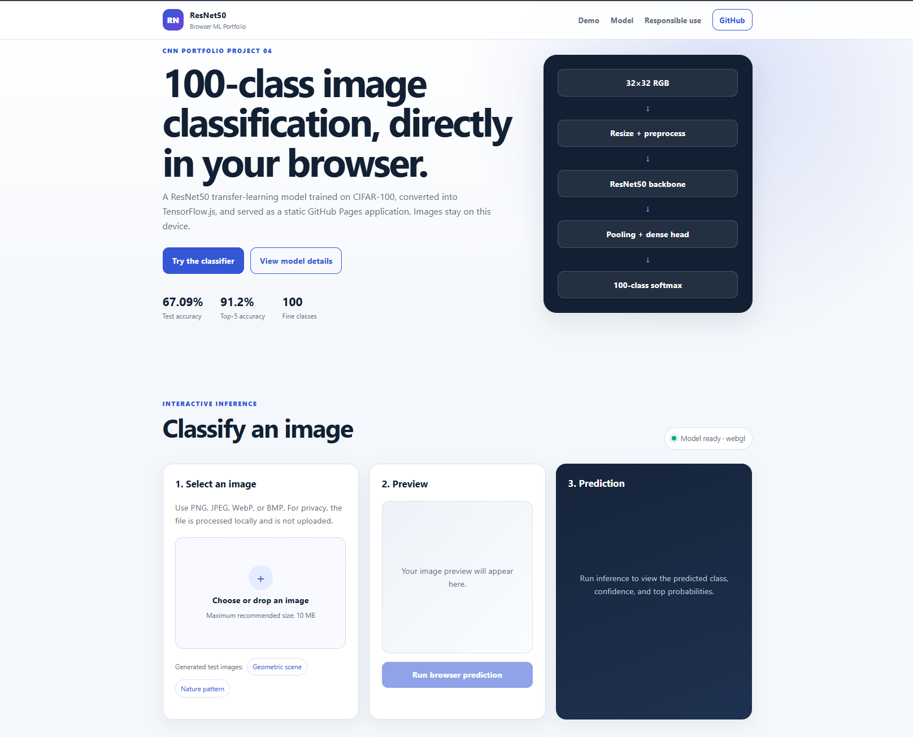
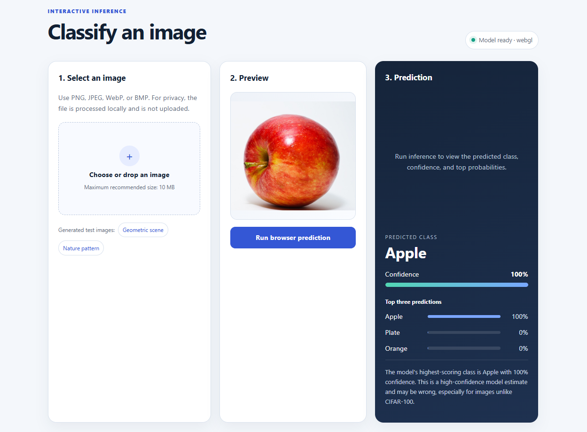

# Image Classification with ResNet50 and TensorFlow.js

[](https://www.python.org/)
[](https://www.tensorflow.org/)
[](https://keras.io/)
[](https://www.tensorflow.org/js)
[](https://unit-mole.github.io/cnn-projects/)
[](https://github.com/unit-mole/cnn-projects/actions/workflows/04-image-classification-resnet.yml)
[](LICENSE)

An end-to-end computer vision project that uses **ResNet50 transfer learning** to classify images across the **100 CIFAR-100 categories**. The repository includes reproducible preprocessing, model training, evaluation, saved artifacts, TensorFlow.js conversion, browser-based inference, automated validation, and deployment through GitHub Pages.

**Status:** Portfolio-ready and deployed  
**Live demo:** [Open the ResNet50 Browser Image Classifier](https://unit-mole.github.io/cnn-projects/)  
**Primary stack:** Python · TensorFlow · Keras · ResNet50 · TensorFlow.js · JavaScript · HTML · CSS · GitHub Actions · GitHub Pages

---

## Responsible Use

This project is intended for educational, technical-learning, and portfolio demonstration purposes.

- The model may classify images incorrectly, particularly when images are blurry, heavily edited, low-resolution, out-of-distribution, or visually different from CIFAR-100 training examples.
- A high softmax confidence score does not guarantee that a prediction is correct.
- The application must not be used as the sole basis for medical, legal, security, safety-critical, hiring, insurance, financial, or production decisions.
- Do not upload private, confidential, copyrighted, sensitive, or personally identifiable images to a public demonstration.
- Predictions should be interpreted as machine-learning estimates rather than guaranteed facts.

---

## Business Problem

Organizations increasingly use computer vision to support product identification, visual inspection, defect review, inventory classification, and image-based quality workflows. Manual image review can be repetitive, inconsistent, and difficult to scale.

This project answers:

> Given an uploaded image, can a ResNet50 model classify it into one of the learned CIFAR-100 categories directly inside the browser?

The deployed application returns:

- Predicted class
- Confidence score
- Top three class probabilities
- Prediction interpretation
- Model and preprocessing details
- Responsible-use guidance

---

## Project Objective

Build a professional image-classification solution that can:

1. Load and validate RGB image data.
2. Resize CIFAR-100 images for a pretrained ResNet50 backbone.
3. Apply consistent preprocessing during training, Python inference, and browser inference.
4. Use ImageNet transfer learning for multi-class classification.
5. Compare ResNet50 against a lightweight baseline.
6. Report top-1 and top-5 classification performance.
7. Save reusable model metadata and class mappings.
8. Convert the trained Keras model into TensorFlow.js format.
9. Run inference entirely in the browser without a Python backend.
10. Validate and publish the static application through GitHub Actions and GitHub Pages.

---

## Dataset

The project uses the **CIFAR-100** image-classification dataset.

| Property | Value |
|---|---|
| Task | Multi-class image classification |
| Classes | 100 fine-grained object categories |
| Source image size | 32 × 32 pixels |
| Color mode | RGB |
| Training images | 40,000 |
| Validation images | 10,000 |
| Test images | 10,000 |
| Model input size | 96 × 96 × 3 |
| Output | 100-class softmax probability vector |

CIFAR-100 includes categories such as:

```text
apple, aquarium_fish, bicycle, bottle, bus, butterfly, chair,
clock, dolphin, elephant, forest, keyboard, lion, motorcycle,
orange, pear, pickup_truck, plate, rabbit, ray, rose, shark,
streetcar, sunflower, television, tiger, train, trout, wolf
```

The full dataset is downloaded through TensorFlow/Keras when required and is not committed to GitHub. Only safe generated sample images are included in the repository.

---

## Tools and Technologies

| Area | Technology |
|---|---|
| Language | Python, JavaScript |
| Deep learning | TensorFlow, Keras |
| CNN architecture | ResNet50 |
| Transfer learning | ImageNet-pretrained backbone |
| Data processing | NumPy, pandas |
| Image processing | Pillow, TensorFlow image utilities |
| Evaluation | scikit-learn, Matplotlib |
| Browser inference | TensorFlow.js |
| Web interface | HTML, CSS, JavaScript |
| Testing | pytest, compile and structure validation |
| Automation | GitHub Actions |
| Hosting | GitHub Pages |
| Model format | Keras `.keras`, TensorFlow.js `model.json` + binary shards |

---

## Project Workflow

```text
CIFAR-100 images and labels
          │
          ▼
Data validation and split preparation
          │
          ▼
RGB conversion and image resizing
          │
          ▼
ResNet-compatible preprocessing
          │
          ▼
Safe training-time augmentation
          │
          ▼
ImageNet-pretrained ResNet50 backbone
          │
          ▼
Global average pooling
          │
          ▼
Dense classification head
          │
          ▼
100-class softmax probabilities
          │
          ▼
Evaluation and error analysis
          │
          ▼
Saved Keras model and metadata
          │
          ▼
TensorFlow.js conversion
          │
          ▼
Static browser application
          │
          ▼
GitHub Actions validation
          │
          ▼
GitHub Pages deployment
```

---

## Image Preprocessing

The project uses the same preprocessing assumptions across training and inference.

- RGB color conversion
- Image resizing from 32 × 32 to 96 × 96
- Float data-type conversion
- ResNet-compatible pixel preprocessing
- Batch-dimension handling
- Label-to-index mapping for 100 classes
- Unsupported-file validation
- Corrupt-image error handling

Maintaining equivalent preprocessing in Python and JavaScript is essential. A mismatch between the training pipeline and browser pipeline can significantly reduce prediction quality.

---

## Data Augmentation

Training-time augmentation is used to improve generalization while preserving class meaning.

Typical transformations include:

- Horizontal flipping where appropriate
- Small rotations
- Minor zoom
- Small translation
- Light contrast variation

Aggressive transformations are avoided because they may distort small CIFAR-100 objects or change the visual meaning of an image.

---

## ResNet50 Architecture

```text
Input image: 96 × 96 × 3
          ↓
ImageNet-pretrained ResNet50 backbone
          ↓
Frozen convolutional feature extractor
          ↓
Global average pooling
          ↓
Dense layer
          ↓
Batch normalization
          ↓
Dropout
          ↓
Dense output layer: 100 units
          ↓
Softmax class probabilities
```

### Why ResNet?

ResNet is a convolutional neural-network architecture that uses **residual connections**. These connections allow information and gradients to move more effectively through deep networks.

Instead of requiring every block to learn a complete transformation, a residual block learns the difference between its input and desired output. This helps reduce vanishing-gradient problems and makes deep architectures such as ResNet50 practical to train and reuse.

ResNet50 is well suited to transfer learning because its ImageNet-pretrained layers already recognize useful visual patterns such as edges, textures, shapes, and object parts.

---

## Transfer-Learning Strategy

The project uses an ImageNet-pretrained ResNet50 backbone as a feature extractor.

### Stage 1: Frozen-backbone training

- Load ResNet50 without its original ImageNet classifier.
- Freeze the pretrained convolutional backbone.
- Train the custom CIFAR-100 classification head.
- Monitor validation performance.

### Stage 2: Optional fine-tuning

Selected deeper layers can be unfrozen and trained with a lower learning rate. This step should be performed carefully to avoid damaging useful pretrained features.

---

## Model Results

| Model | Validation Accuracy | Test Accuracy | Top-5 Accuracy |
|---|---:|---:|---:|
| Lightweight baseline | 12.62% | 12.57% | — |
| ResNet50 transfer learning | 67.07% | 67.09% | 91.20% |

The ResNet50 model substantially outperforms the baseline. The top-5 score shows that the correct category appears within the five highest-probability classes for most test examples.

Accuracy should still be interpreted with care because CIFAR-100 contains many visually similar categories, and a single aggregate metric does not fully describe class-specific behavior.

---

## Evaluation

The evaluation pipeline supports:

- Top-1 accuracy
- Top-5 accuracy
- Precision
- Recall
- F1-score
- Macro F1-score
- Weighted F1-score
- Per-class classification report
- Confusion matrix
- Sample predictions
- Correct and incorrect prediction review
- Low-confidence prediction analysis

### Why multiple metrics matter

- **Accuracy** measures the overall proportion of correct classifications.
- **Precision** measures how reliable predictions for a class are.
- **Recall** measures how many real examples of a class are captured.
- **F1-score** balances precision and recall.
- **Macro F1** gives each class equal importance.
- **Weighted F1** accounts for class frequency.
- **Confusion matrices** reveal which categories are commonly confused.
- **Top-5 accuracy** is useful for large multi-class problems such as CIFAR-100.

---

## Browser Demo

The static application performs inference directly in the user's browser.

It supports:

- PNG, JPEG, WebP, and BMP images
- Drag-and-drop or file selection
- Image preview
- Browser-based TensorFlow.js inference
- Predicted class
- Confidence score
- Top three predictions
- Prediction summary
- Local image processing
- Responsible-use information

No Python backend is required. The uploaded image is processed locally by the browser application.

### Live Application

[](https://unit-mole.github.io/cnn-projects/)

### Application Overview



*Live browser-based image-classification interface deployed using GitHub Pages and TensorFlow.js.*

### Apple Prediction Example



*Browser-based ResNet50 inference on an uploaded apple image. The interface displays the predicted class, softmax confidence, and top three probabilities directly in the browser. Confidence represents the model's estimate and does not guarantee correctness.*

---

## Browser Inference Workflow

```text
User selects an image
          │
          ▼
Browser validates the file
          │
          ▼
Image is decoded into an HTML element
          │
          ▼
TensorFlow.js resizes the image
          │
          ▼
ResNet preprocessing is applied
          │
          ▼
Batch dimension is added
          │
          ▼
tf.loadLayersModel() loads model.json
          │
          ▼
model.predict() returns 100 probabilities
          │
          ▼
Probabilities are ranked
          │
          ▼
Predicted class and top three results are displayed
```

---

## Model Conversion

The trained Keras model is converted into TensorFlow.js Layers format.

```text
Keras model
    ↓
resnet50_cifar100.keras
    ↓
TensorFlow.js converter
    ↓
model.json
    ↓
Binary weight shards
    ↓
web/tfjs_model/
    ↓
GitHub Pages
```

Key browser artifacts:

| Artifact | Purpose |
|---|---|
| `web/tfjs_model/model.json` | Model architecture and weight manifest |
| `web/tfjs_model/group1-shard*.bin` | Converted model weights |
| `web/metadata.json` | Input size, preprocessing, labels, and model details |
| `web/app.js` | Browser preprocessing and inference |
| `web/index.html` | Application structure |
| `web/style.css` | Responsive presentation |

---

## Model Artifacts

| Artifact | Purpose |
|---|---|
| `models/resnet50_cifar100.keras` | Trained Keras model for local evaluation and conversion |
| `models/class_mapping.json` | CIFAR-100 index-to-label mapping |
| `models/model_metadata.json` | Model, preprocessing, and dataset metadata |
| `web/tfjs_model/model.json` | TensorFlow.js model manifest |
| `web/tfjs_model/group1-shard*.bin` | TensorFlow.js weight shards |
| `web/metadata.json` | Browser inference configuration |
| `outputs/metrics/model_metrics.json` | Recorded model metrics |
| `outputs/metrics/browser_model_equivalence.json` | Conversion-equivalence validation |

Large model artifacts may be excluded from normal Git tracking when they exceed recommended repository limits. The browser-ready TensorFlow.js files are retained for deployment.

---

## Run the Browser Demo Locally

### 1. Open the project

```bash
cd cnn-projects/04-image-classification-resnet
```

### 2. Start a local web server

```bash
python -m http.server 8000 --directory web
```

### 3. Open the application

```text
http://localhost:8000
```

A local HTTP server is required because browsers generally block TensorFlow.js model loading from direct `file://` paths.

---

## Run the Python Project Locally

### 1. Create a virtual environment

**Windows**

```bat
py -3.11 -m venv .venv
.venv\Scripts\activate
```

**macOS / Linux**

```bash
python3 -m venv .venv
source .venv/bin/activate
```

### 2. Install dependencies

```bash
python -m pip install --upgrade pip
python -m pip install -r requirements.txt
```

### 3. Run tests and validation

```bash
python -m pytest -q
python scripts/validate_project.py
```

### 4. Train the model when required

```bash
python scripts/train_model.py
```

### 5. Evaluate the model

```bash
python scripts/evaluate_model.py
```

### 6. Convert to TensorFlow.js

```bash
python scripts/convert_to_tfjs.py
```

---

## Deployment

- **Repository:** `unit-mole/cnn-projects`
- **Source branch:** `main`
- **Deployment branch:** `gh-pages`
- **Published folder:** `04-image-classification-resnet/web/`
- **GitHub Pages source:** `gh-pages` → `/(root)`
- **Live application:** https://unit-mole.github.io/cnn-projects/

The GitHub Actions workflow:

1. Checks out the repository.
2. Runs lightweight project validation.
3. Validates required Python and browser files.
4. Confirms that the TensorFlow.js model manifest exists.
5. Publishes the static `web/` directory to the `gh-pages` branch.
6. Allows GitHub Pages to serve the site over HTTPS.

The workflow file is stored at:

```text
.github/workflows/04-image-classification-resnet.yml
```

---

## Project Structure

```text
cnn-projects/
├── .github/
│   └── workflows/
│       └── 04-image-classification-resnet.yml
│
└── 04-image-classification-resnet/
    ├── app/
    ├── archive/
    ├── data/
    │   └── sample_images/
    ├── images/
    │   ├── resnet_browser_demo_home.png
    │   └── resnet_prediction_result.png
    ├── models/
    │   ├── class_mapping.json
    │   ├── model_metadata.json
    │   └── tfjs_model/
    ├── notebooks/
    │   └── image_classification_resnet.ipynb
    ├── outputs/
    │   ├── figures/
    │   ├── metrics/
    │   └── predictions/
    ├── scripts/
    ├── src/
    ├── tests/
    ├── web/
    │   ├── index.html
    │   ├── app.js
    │   ├── style.css
    │   ├── metadata.json
    │   ├── sample_images/
    │   └── tfjs_model/
    ├── Dockerfile
    ├── README.md
    ├── README_GITHUB_PAGES.md
    ├── README_HOSTING.md
    ├── requirements.txt
    └── train_model.py
```

---

## Limitations

- CIFAR-100 source images are small and contain limited visual detail.
- Real-world high-resolution images may differ substantially from the training distribution.
- Visually similar classes can be confused.
- Synthetic, abstract, or unfamiliar images may produce low-confidence or incorrect results.
- Softmax scores are not automatically calibrated probabilities.
- Browser performance varies by device, browser, available memory, and WebGL support.
- ResNet50 is larger than mobile-oriented architectures and may take time to load during the first visit.
- The model has not been validated for safety-critical or production use.

---

## Future Improvements

- Fine-tune selected ResNet50 layers using a lower learning rate.
- Add confidence calibration.
- Add Grad-CAM visual explanations in the Python analysis.
- Add a confusion-matrix and misclassification gallery to the README.
- Compare ResNet50 with MobileNetV2, EfficientNet, and VGG16.
- Evaluate image compression and TensorFlow.js quantization.
- Add progressive model-loading feedback.
- Improve mobile browser performance.
- Add offline caching through a service worker.
- Publish the trained Keras model through a suitable model registry.
- Add automated browser integration tests.

---

## Skills Demonstrated

- Convolutional neural networks
- ResNet architecture
- Transfer learning
- Multi-class image classification
- Image preprocessing
- Data augmentation
- Model evaluation
- Top-k prediction analysis
- Error analysis
- Model artifact management
- TensorFlow.js conversion
- Browser-based machine learning
- JavaScript inference pipelines
- Static web application development
- GitHub Actions
- GitHub Pages deployment
- Responsible AI communication
- Portfolio-focused ML engineering

---

## Portfolio Positioning

**One-line description:** ResNet50 image-classification system trained on CIFAR-100 and deployed as a browser-based TensorFlow.js application through GitHub Pages.

**Pinned repository description:** End-to-end computer vision portfolio project featuring ResNet50 transfer learning, multi-class evaluation, TensorFlow.js model conversion, browser inference, automated validation, and GitHub Pages deployment.

This project connects naturally to a Quality Data Scientist background because image classification can support visual inspection, product categorization, defect review, automated quality checks, image-based anomaly analysis, and applied AI for inspection workflows.

---

## Author

**Anmol Tripathi**

Quality Data Scientist building a professional portfolio in Data Science, Machine Learning, Applied AI, Computer Vision, Analytics Engineering, and Quality Analytics.
