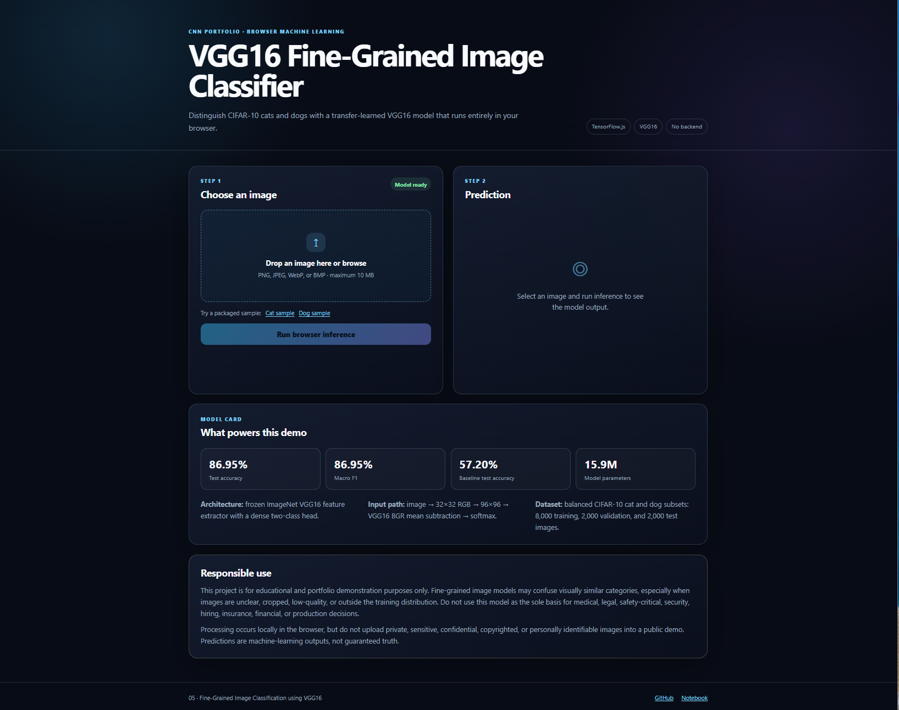
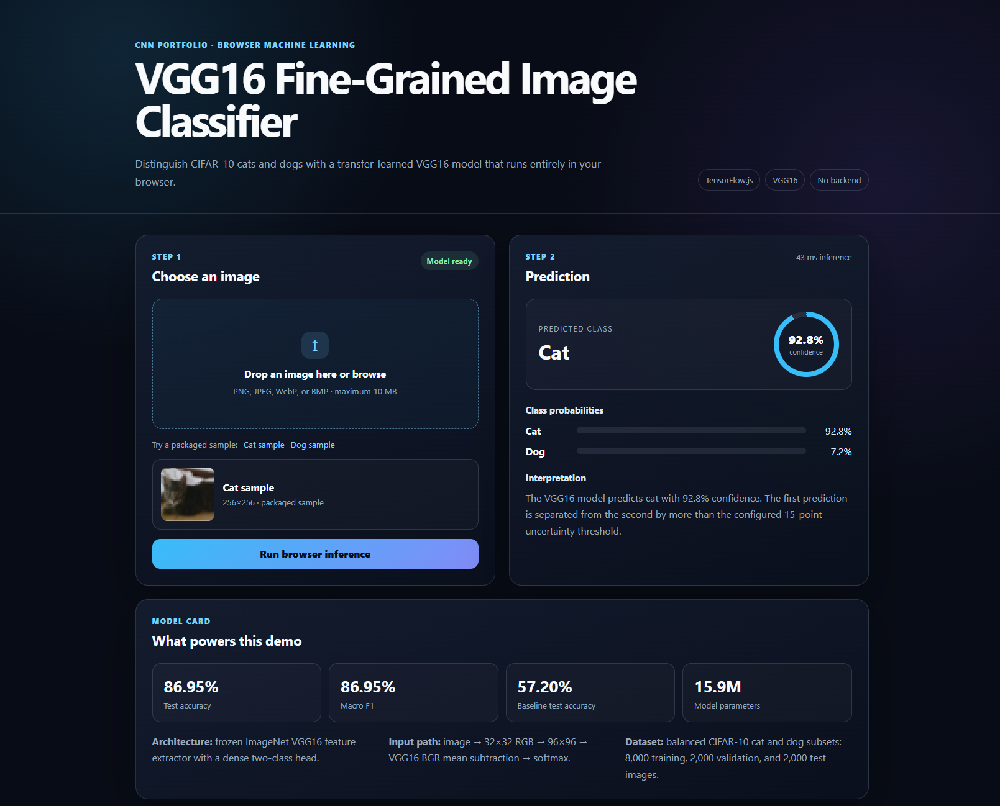
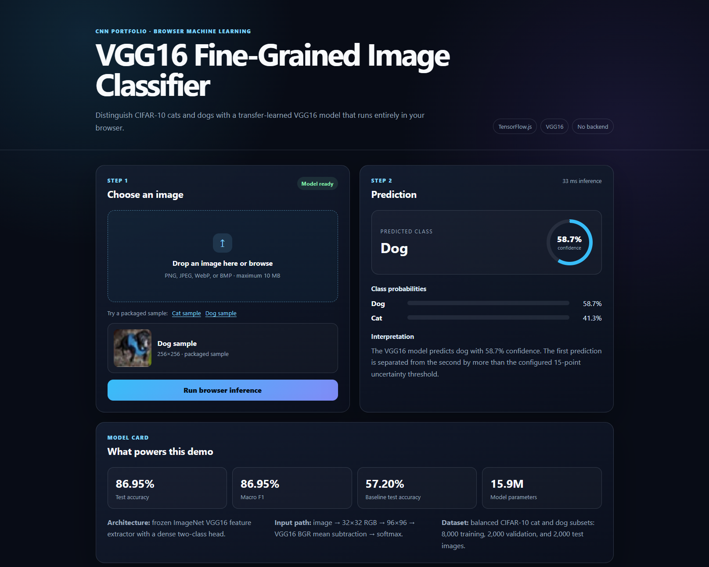

# VGG16 Fine-Grained Image Classification with TensorFlow.js

[](https://www.python.org/)
[](https://www.tensorflow.org/)
[](https://www.tensorflow.org/js)
[](https://vgg16-fine-grained-image-classifica.vercel.app/)
[](https://github.com/unit-mole/cnn-projects/actions/workflows/05-fine-grained-image-classification-vgg16.yml)
[](LICENSE)

An end-to-end computer vision project that uses **VGG16 transfer learning** to classify CIFAR-10 cat and dog images. The project includes reproducible image preprocessing, data augmentation, a frozen ImageNet feature extractor, baseline comparison, model evaluation, TensorFlow.js conversion, and a polished browser application deployed on Vercel.

**Status:** Portfolio-ready, CI-validated, and deployed  
**Live demo:** [Open the VGG16 browser classifier](https://vgg16-fine-grained-image-classifica.vercel.app/)  
**Repository:** [Open Project 05 on GitHub](https://github.com/unit-mole/cnn-projects/tree/main/05-fine-grained-image-classification-vgg16)  
**Primary stack:** Python · TensorFlow · Keras · VGG16 · TensorFlow.js · JavaScript · HTML · CSS · Vercel

---

## Responsible Use

This project is for educational and portfolio demonstration purposes only.

- The model can confuse visually similar categories, particularly when images are unclear, cropped, low-resolution, poorly lit, or different from the training distribution.
- Predictions are machine-learning estimates and should not be interpreted as guaranteed truth.
- The model should not be used as the sole basis for medical, legal, safety-critical, security, hiring, insurance, financial, or production decisions.
- Do not upload private, sensitive, confidential, copyrighted, or personally identifiable images to a public demo.
- Real-world computer vision systems require stronger validation, monitoring, data governance, human review, and domain-specific testing.

---

## Business Problem

Image-based workflows often require people to distinguish categories that share similar visual characteristics. Manual review can become slow, inconsistent, and difficult to scale.

This project answers:

> Given an image, can a transfer-learned VGG16 model distinguish whether it is more visually similar to a cat or a dog and communicate the model's confidence transparently?

The deployed pipeline returns:

- Predicted class
- Confidence score
- Class probabilities
- Browser inference time
- Prediction interpretation
- Similar-class uncertainty context
- Responsible-use guidance

The project is also relevant to quality-data and inspection use cases such as product-variant classification, defect-type recognition, visual review automation, and image-based quality analytics.

---

## Project Objective

Build a professional computer vision solution that can:

1. Load and validate image data.
2. Filter CIFAR-10 into cat and dog classes.
3. Create reproducible training, validation, and test sets.
4. Apply safe image augmentation.
5. Reuse ImageNet features through VGG16 transfer learning.
6. Compare the deep-learning model against a simple baseline.
7. Evaluate accuracy, precision, recall, F1-score, and confusion patterns.
8. Save and reload model artifacts.
9. Convert the Keras model into TensorFlow.js format.
10. Run inference entirely inside a web browser.
11. Deploy the static application through Vercel without a Python backend.
12. Present results in a recruiter-friendly portfolio format.

---

## Dataset

The project uses **CIFAR-10**, filtered to the following two classes:

| Encoded label | Class | Description |
|---:|---|---|
| 0 | Cat | CIFAR-10 cat images |
| 1 | Dog | CIFAR-10 dog images |

### Dataset split

| Split | Images |
|---|---:|
| Training | 8,000 |
| Validation | 2,000 |
| Test | 2,000 |
| **Total** | **12,000** |

### Training class distribution

| Class | Count | Share |
|---|---:|---:|
| Cat | 4,005 | 50.06% |
| Dog | 3,995 | 49.94% |

The training subset is effectively balanced, so aggressive imbalance correction is unnecessary. Stratified evaluation and per-class metrics are still important because overall accuracy can hide class-specific weaknesses.

The full public dataset is not stored in the repository. It is loaded through TensorFlow/Keras utilities during training. Only safe sample images and generated outputs should be committed.

---

## Tools and Technologies

| Area | Technology |
|---|---|
| Language | Python, JavaScript |
| Deep learning | TensorFlow, Keras |
| CNN architecture | VGG16 |
| Transfer learning | ImageNet-pretrained frozen backbone |
| Data processing | NumPy, pandas |
| Image preprocessing | TensorFlow image layers, VGG16 preprocessing |
| Evaluation | scikit-learn, Matplotlib |
| Browser inference | TensorFlow.js |
| Frontend | HTML, CSS, JavaScript |
| Hosting | Vercel |
| Testing / CI | pytest, import checks, artifact validation, GitHub Actions |
| Model persistence | `.keras`, JSON, TensorFlow.js `model.json` and binary shards |

---

## Project Workflow

```text
CIFAR-10 dataset
        │
        ▼
Filter cat and dog classes
        │
        ▼
Validate arrays and class mapping
        │
        ▼
Train / validation / test split
        │
        ▼
Safe image augmentation
        │
        ▼
Resize 32×32 images to 96×96
        │
        ▼
VGG16 preprocessing
        │
        ▼
Frozen ImageNet VGG16 feature extractor
        │
        ▼
Dense classification head
        │
        ▼
Training and validation monitoring
        │
        ▼
Evaluation and error analysis
        │
        ▼
Save Keras model and metadata
        │
        ▼
Convert model to TensorFlow.js
        │
        ▼
Static browser inference
        │
        ▼
Vercel deployment
```

---

## Image Preprocessing

The same model assumptions are preserved across training, Python inference, and browser inference.

### Processing sequence

1. Read an RGB image.
2. Validate the image format.
3. Convert the image to three color channels.
4. Resize the image to the required model dimensions.
5. Convert values to the expected floating-point representation.
6. Apply VGG16-compatible preprocessing.
7. Add the batch dimension.
8. Run inference.
9. Convert softmax output into class probabilities.

### Input path

```text
Uploaded image
      ↓
RGB conversion
      ↓
Resize to 32×32 input representation
      ↓
Model resizing layer to 96×96
      ↓
VGG16 BGR mean subtraction
      ↓
Softmax probabilities
```

The original CIFAR-10 images are `32×32×3`. Inside the model, images are resized to `96×96×3` before they pass through the VGG16 backbone.

---

## Data Augmentation

The training pipeline applies deliberately moderate augmentation:

- Horizontal flip
- Small rotation
- Small zoom

These transformations improve generalization without aggressively removing the visual details required for classification.

The project avoids heavy cropping, blur, and extreme color distortion because those operations can remove discriminative image information or change the visual meaning of a sample.

---

## VGG16 Architecture

```text
Input image: 32×32×3
        ↓
Training-only augmentation
        ↓
Resize to 96×96×3
        ↓
VGG16 preprocessing
        ↓
Frozen VGG16 backbone
ImageNet weights, include_top=False
        ↓
Flatten
        ↓
Dense: 256, ReLU
        ↓
Batch normalization
        ↓
Dropout: 0.50
        ↓
Dense: 128, ReLU
        ↓
Dropout: 0.40
        ↓
Dense: 2, Softmax
        ↓
Cat / Dog probabilities
```

### Why VGG16?

VGG16 is a convolutional neural network known for repeatedly using small `3×3` convolution filters. Early layers learn simple visual features such as edges and textures, while deeper layers learn more complex shapes and object parts.

Using transfer learning allows the project to reuse general visual features learned from ImageNet instead of training a large CNN entirely from scratch.

---

## Transfer-Learning Strategy

The model uses a two-part design:

1. **Frozen VGG16 backbone**  
   The ImageNet-pretrained convolutional layers act as a feature extractor.

2. **Custom classification head**  
   Dense, batch-normalization, dropout, and softmax layers adapt the extracted features to the two target classes.

### Training configuration

- Optimizer: Adam
- Initial learning rate: `0.001`
- Loss: categorical cross-entropy
- Maximum epochs: `15`
- Batch size: `128`
- Early stopping on validation accuracy
- Reduce learning rate on validation-loss plateau
- Restore best validation weights

Freezing the backbone lowers training cost and reduces the risk of overfitting on the relatively small filtered dataset.

---

## Model Results

### Baseline comparison

| Model | Validation accuracy | Test accuracy |
|---|---:|---:|
| Logistic Regression baseline | 56.65% | 57.20% |
| **VGG16 transfer model** | **85.55%** | **86.95%** |

The VGG16 transfer-learning model improves test accuracy by **29.75 percentage points** over the baseline.

### Summary metrics

| Metric | Result |
|---|---:|
| Test accuracy | **86.95%** |
| Macro F1-score | **86.95%** |
| Baseline test accuracy | **57.20%** |
| Model parameters | **15.9 million** |

### Per-class performance

| Class | Precision | Recall | F1-score | Support |
|---|---:|---:|---:|---:|
| Cat | 87.59% | 86.10% | 86.84% | 1,000 |
| Dog | 86.33% | 87.80% | 87.06% | 1,000 |

The balanced test support makes the per-class results directly comparable.

> **Top-2 note:** Top-2 accuracy is not emphasized for this binary classifier because both available classes are necessarily included in the top two predictions.

---

## Evaluation Approach

The project evaluates more than accuracy alone:

- Accuracy
- Per-class precision
- Per-class recall
- Per-class F1-score
- Macro F1-score
- Confusion matrix
- Classification report
- Baseline comparison
- Correct and incorrect prediction examples
- Confidence review
- Similar-class uncertainty analysis

### Why these metrics matter

- **Accuracy** measures overall correctness.
- **Precision** measures the reliability of predictions for a class.
- **Recall** measures how many true examples of a class were captured.
- **F1-score** balances precision and recall.
- **Macro F1** gives equal importance to each class.
- **Confusion analysis** shows whether one class is systematically mistaken for another.
- **Confidence review** helps identify uncertain and potentially misleading predictions.

---

## Similar-Class Confidence Logic

The browser app compares the highest and second-highest class probabilities.

```text
If top probability − second probability < 0.15:
    show an uncertainty warning
```

When probabilities are close, the interface can explain that the image contains visual evidence associated with both classes.

This avoids presenting every prediction as equally certain.

---

## TensorFlow.js Browser Demo

The primary deployment uses **Vercel + TensorFlow.js**.

The model runs directly inside the visitor's browser:

```text
User selects an image
        ↓
JavaScript decodes the image
        ↓
Browser preprocessing
        ↓
TensorFlow.js loads model.json
        ↓
Binary model shards are loaded
        ↓
model.predict() runs locally
        ↓
Cat and dog probabilities are displayed
```

### Browser features

- Drag-and-drop image upload
- File browser
- Packaged cat sample
- Packaged dog sample
- Image preview
- Predicted class
- Confidence ring
- Class-probability bars
- Inference time
- Plain-language interpretation
- Model card and metrics
- Responsible-use information
- No Python backend

Because inference runs in the browser, uploaded images do not need to be sent to a project-specific prediction server.

---

## Live Application

**Vercel deployment:**  
[https://vgg16-fine-grained-image-classifica.vercel.app/](https://vgg16-fine-grained-image-classifica.vercel.app/)

### Project Overview



### Cat Prediction



### Dog Prediction



The packaged examples verify that both prediction paths work in the deployed browser application.

---

## Model Artifacts

| Artifact | Purpose |
|---|---|
| `models/vgg16_fine_grained_classification_model.keras` | Complete trained Keras model |
| `models/vgg16_browser_inference.keras` | Browser-oriented Keras export |
| `models/class_mapping.json` | Encoded class labels |
| `models/model_metadata.json` | Model and preprocessing configuration |
| `models/tfjs_model/model.json` | TensorFlow.js model graph and manifest |
| `models/tfjs_model/group1-shard*.bin` | TensorFlow.js weight shards |
| `web/metadata.json` | Frontend model metadata |
| `web/tfjs_model/model.json` | Model loaded by the deployed app |
| `web/tfjs_model/group1-shard*.bin` | Browser model weights |

Large model files may generate GitHub size warnings. Git LFS can be used for large `.keras` files where appropriate.

---

## Run the Browser App Locally

The static website does not require a Python ML backend.

### 1. Open the project

```bat
cd /d "cnn-projects\05-fine-grained-image-classification-vgg16"
```

### 2. Start a local web server with Python

```bat
python -m http.server 8000 --directory web
```

Open:

```text
http://localhost:8000
```

Do not open `web/index.html` by double-clicking it. Serving the folder over HTTP avoids browser restrictions when loading the TensorFlow.js model files.

### Optional Node.js method

```bash
npm run dev
```

---

## Run the Python Pipeline Locally

### 1. Create a virtual environment

**Windows**

```bat
py -3.11 -m venv .venv
.venv\Scripts\activate
```

**macOS / Linux**

```bash
python3.11 -m venv .venv
source .venv/bin/activate
```

### 2. Install dependencies

```bash
python -m pip install --upgrade pip
python -m pip install -r requirements.txt
```

### 3. Run tests

```bash
python -m pytest -q
python -m compileall src tests scripts
```

### 4. Train the model

```bash
python scripts/train_model.py
```

### 5. Evaluate the model

```bash
python scripts/evaluate_model.py
```

### 6. Convert to TensorFlow.js

```bash
python scripts/convert_to_tfjs.py
```

---

## Vercel Deployment

| Setting | Value |
|---|---|
| Repository | `unit-mole/cnn-projects` |
| Branch | `main` |
| Root directory | `05-fine-grained-image-classification-vgg16` |
| Application preset | `Other` |
| Build command | `npm run build` |
| Output directory | `web` |
| Install command | Skipped through `vercel.json` |
| Environment variables | None |
| Node.js runtime | `24.x` |
| Live application | https://vgg16-fine-grained-image-classifica.vercel.app/ |

The deployment publishes the static `web` folder. Python dependencies are not installed because the deployed website uses TensorFlow.js rather than server-side TensorFlow.

See `README_VERCEL.md` for the detailed deployment and troubleshooting guide.

---

## GitHub Actions

The project workflow is stored at:

```text
.github/workflows/05-fine-grained-image-classification-vgg16.yml
```

The CI pipeline performs lightweight portfolio checks:

- Install CI dependencies
- Run Python tests
- Compile/import Python modules
- Validate frontend files
- Confirm `web/index.html`, `web/style.css`, and `web/app.js`
- Confirm TensorFlow.js `model.json`
- Confirm binary model shards
- Avoid full VGG16 retraining in GitHub Actions

---

## Project Structure

```text
cnn-projects/
├── .github/
│   └── workflows/
│       └── 05-fine-grained-image-classification-vgg16.yml
│
└── 05-fine-grained-image-classification-vgg16/
    ├── .streamlit/
    ├── app/
    ├── archive/
    ├── data/
    │   ├── sample_images/
    │   └── README_data.md
    ├── images/
    │   ├── project_overview.png
    │   ├── cat_prediction_demo.png
    │   └── dog_prediction_demo.png
    ├── models/
    │   ├── vgg16_fine_grained_classification_model.keras
    │   ├── vgg16_browser_inference.keras
    │   ├── class_mapping.json
    │   ├── model_metadata.json
    │   └── tfjs_model/
    ├── notebooks/
    ├── outputs/
    ├── scripts/
    ├── src/
    ├── tests/
    ├── web/
    │   ├── index.html
    │   ├── style.css
    │   ├── app.js
    │   ├── metadata.json
    │   ├── sample_images/
    │   └── tfjs_model/
    ├── Dockerfile
    ├── package.json
    ├── vercel.json
    ├── README.md
    ├── README_VERCEL.md
    ├── README_HUGGINGFACE.md
    ├── requirements.txt
    └── train_model.py
```

---

## Limitations

- The task contains only two classes.
- CIFAR-10 images are low resolution.
- The model may learn background or dataset-specific visual shortcuts.
- Confidence scores are not guarantees of correctness.
- The VGG16 browser model is relatively large and may load slowly on weak connections.
- Real-world cat and dog photographs can differ significantly from CIFAR-10 images.
- The project does not currently include formal probability calibration.
- The frozen backbone was not extensively fine-tuned.
- Broader fine-grained categories would require more classes and higher-resolution images.

---

## Future Improvements

- Add calibration metrics and reliability diagrams.
- Fine-tune selected upper VGG16 blocks.
- Compare VGG16 with MobileNetV2, ResNet, and EfficientNet.
- Add Grad-CAM explainability examples.
- Add higher-resolution fine-grained datasets.
- Quantize or compress the TensorFlow.js model.
- Add progressive model-loading feedback.
- Add accessibility and mobile-performance audits.
- Expand from binary classification to multi-class species, breeds, products, or defect types.
- Add automated browser tests.
- Add model monitoring and version metadata.
- Create a Hugging Face Spaces fallback for the full Keras model.

---

## Skills Demonstrated

- Convolutional neural networks
- VGG16 architecture
- Transfer learning
- Image preprocessing
- Data augmentation
- Binary image classification
- TensorFlow and Keras
- Model evaluation
- Per-class metric analysis
- Baseline comparison
- Error and confidence analysis
- Model persistence
- TensorFlow.js conversion
- Browser-based machine learning
- HTML, CSS, and JavaScript
- Static web deployment
- Vercel monorepo configuration
- GitHub Actions
- Responsible AI communication
- Professional ML project organization

---

## Portfolio Positioning

**One-line description:**  
VGG16 transfer-learning classifier that distinguishes CIFAR-10 cats and dogs and performs TensorFlow.js inference entirely inside a Vercel-hosted browser application.

**Pinned-project description:**  
End-to-end computer vision project featuring VGG16 transfer learning, image preprocessing, baseline comparison, class-level evaluation, TensorFlow.js conversion, browser-based inference, GitHub Actions, and Vercel deployment.

This project supports a transition from Quality Data Science toward broader Data Science, Machine Learning, Computer Vision, Applied AI, Analytics Engineering, and Quality Analytics roles.

Its techniques connect naturally to:

- Automated visual inspection
- Product-variant classification
- Defect-category classification
- Subtle visual-difference recognition
- Image-based anomaly review
- Quality-control analytics
- Applied AI for inspection workflows

---

## Author

**Anmol Tripathi**

Quality Data Scientist building a professional portfolio across Data Science, Machine Learning, Computer Vision, Applied AI, Analytics Engineering, and Quality Analytics.
