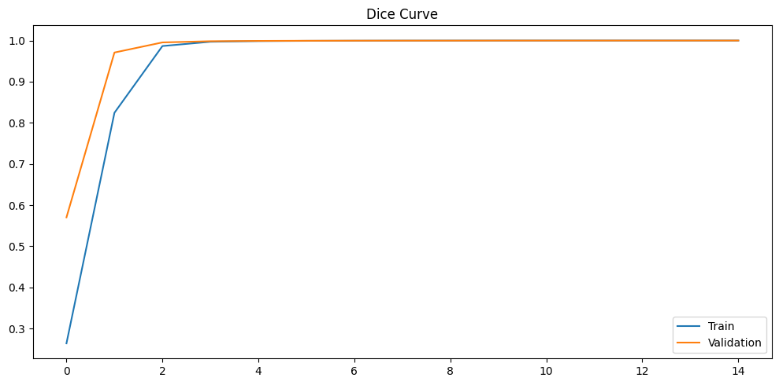
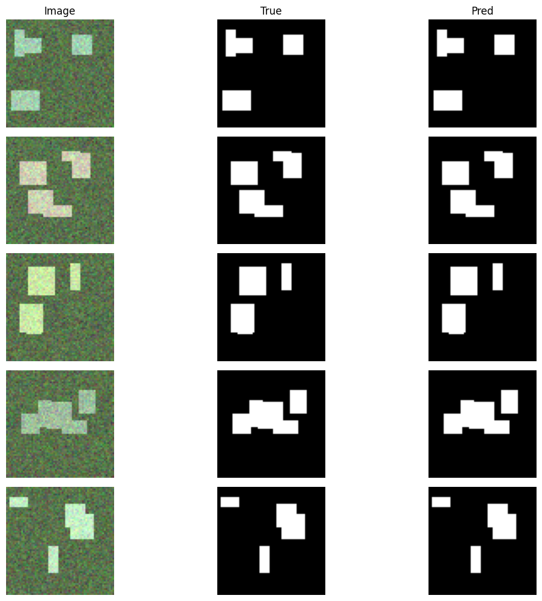
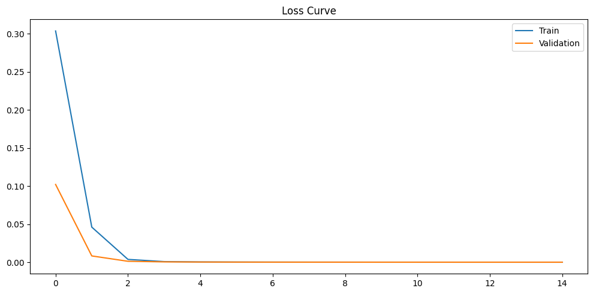
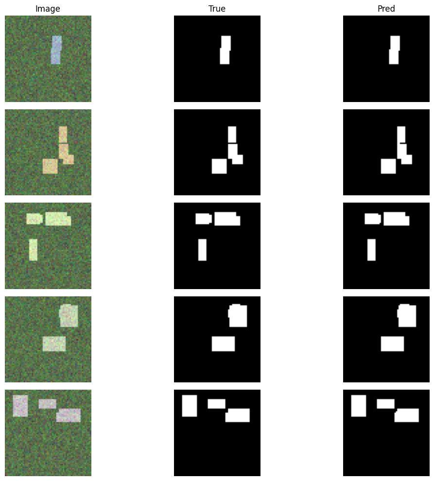
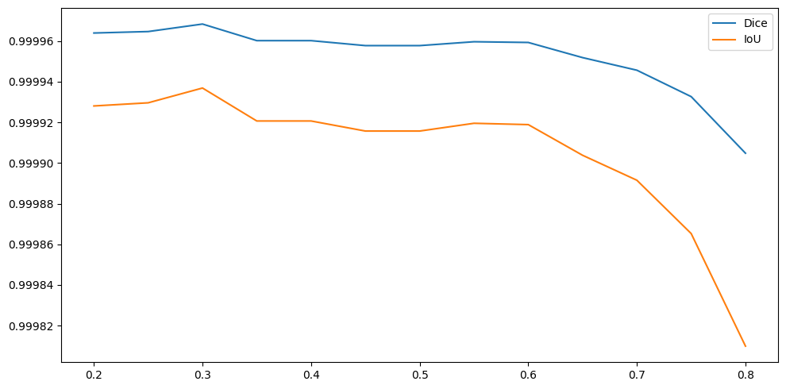
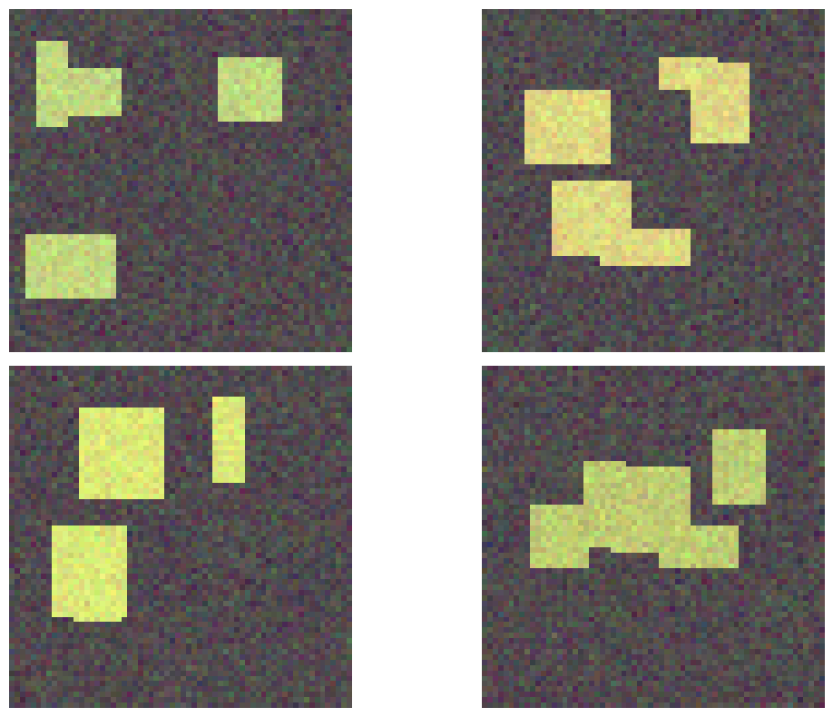
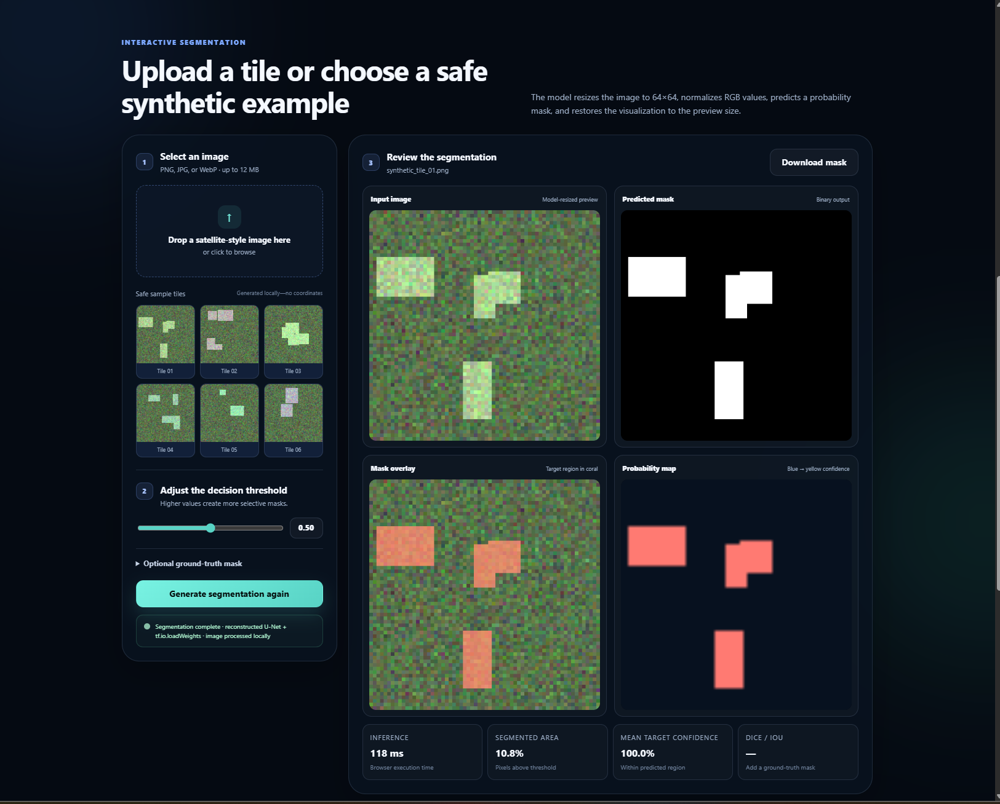
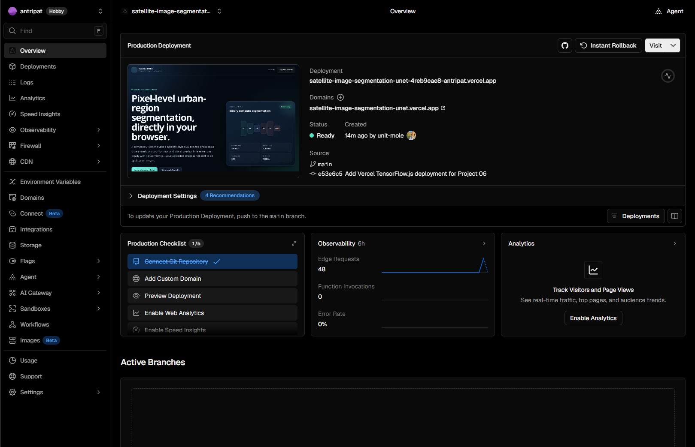

# Satellite Image Segmentation using U-Net

[](https://www.python.org/)
[](https://www.tensorflow.org/)
[](https://www.tensorflow.org/js)
[](https://satellite-image-segmentation-unet.vercel.app/)
[](https://github.com/unit-mole/cnn-projects/actions/workflows/06-satellite-image-segmentation-unet.yml)
[](LICENSE)

An end-to-end Computer Vision project that uses a compact **U-Net convolutional neural network** to perform binary semantic segmentation on satellite-style RGB images. The repository includes reproducible synthetic-data generation, image and mask preprocessing, U-Net training, Dice and IoU evaluation, visual error analysis, saved Keras and TensorFlow.js artifacts, automated tests, GitHub Actions validation, and a fully client-side browser application deployed through **Vercel + TensorFlow.js**.

**Status:** Portfolio-ready, CI-validated, and deployed  
**Live demo:** [Open the Satellite Image Segmentation application](https://satellite-image-segmentation-unet.vercel.app/)  
**Source code:** [View Project 06 on GitHub](https://github.com/unit-mole/cnn-projects/tree/main/06-satellite-image-segmentation-unet)  
**Primary stack:** Python · TensorFlow · Keras · U-Net · TensorFlow.js · JavaScript · HTML · CSS · Vercel

---

## Responsible Use

This project is for educational and portfolio demonstration purposes only.

- The supplied model was trained on procedurally generated satellite-style tiles rather than operational satellite imagery.
- Real satellite images may differ because of clouds, shadows, seasonal variation, sensor type, spatial resolution, lighting, compression, and annotation quality.
- Predicted masks are machine-learning outputs and should not be treated as official geospatial analysis.
- Do not use the model as the sole basis for emergency response, environmental enforcement, land ownership, military, legal, financial, agricultural, infrastructure, or public-policy decisions.
- Do not upload private, confidential, restricted, copyrighted, or sensitive geospatial imagery to a public application.

---

## Business Problem

Satellite and aerial imagery can contain large amounts of visual information that would be expensive and time-consuming to inspect manually at pixel level.

This project answers:

> Given an RGB satellite-style image, can a U-Net model identify and segment the target urban-structure regions automatically?

The deployed browser pipeline returns:

- Input image
- Predicted binary segmentation mask
- Mask overlay
- Probability map
- Segmented-area percentage
- Mean target confidence
- Browser inference time
- Optional Dice and IoU scores when a ground-truth mask is supplied
- Downloadable predicted mask

---

## Project Objective

Build a portfolio-ready semantic-segmentation solution that can:

1. Generate and validate paired satellite-style images and masks.
2. Apply consistent image and mask preprocessing.
3. Train a compact U-Net with encoder-decoder skip connections.
4. Produce pixel-level probability and binary segmentation masks.
5. Evaluate performance using Dice coefficient and IoU.
6. Compare U-Net performance with a threshold-based baseline.
7. Create overlays, probability maps, and error-analysis visuals.
8. Save and reload trained model artifacts.
9. Convert the trained model for TensorFlow.js inference.
10. Run inference entirely inside the user's browser.
11. Deploy the static application through Vercel.
12. Validate the project using tests and GitHub Actions.

---

## Dataset

The portfolio version uses a reproducible, procedurally generated dataset of synthetic satellite-style RGB tiles.

| Property | Value |
|---|---|
| Dataset type | Synthetic urban satellite-style imagery |
| Total samples | 2,500 |
| Training samples | 1,750 |
| Validation samples | 375 |
| Test samples | 375 |
| Random seed | 42 |
| Input shape | `64 × 64 × 3` |
| Input color mode | RGB |
| Mask shape | `64 × 64 × 1` |
| Segmentation type | Binary semantic segmentation |
| Class 0 | Background |
| Class 1 | Synthetic urban structure |
| Normalization | Pixel values scaled to `[0, 1]` |
| Inference threshold | `0.50` |

Each mask contains multiple building-like rectangular regions. The corresponding target pixels are made visually distinguishable in the synthetic image.

Only safe generated sample tiles are included in the public browser demo. They contain no real coordinates, private locations, or sensitive geospatial metadata.

---

## Tools and Technologies

| Area | Technology |
|---|---|
| Language | Python, JavaScript |
| Deep learning | TensorFlow, Keras |
| Architecture | Compact U-Net |
| Computer vision | Semantic segmentation, image-mask preprocessing |
| Data processing | NumPy, pandas, Pillow |
| Evaluation | Dice, IoU, precision, recall, F1, pixel accuracy |
| Visualization | Matplotlib, browser Canvas API |
| Browser inference | TensorFlow.js |
| Front end | HTML, CSS, JavaScript |
| Hosting | Vercel |
| Alternative app | Gradio |
| Testing / quality | pytest, project validation, JavaScript syntax checks |
| Automation | GitHub Actions |
| Model formats | `.keras`, TensorFlow.js JSON and binary weights |

---

## Project Workflow

```text
Synthetic RGB image-mask generation
                │
                ▼
Image-mask pairing and validation
                │
                ▼
Image resizing and normalization
                │
                ▼
Binary mask resizing and encoding
                │
                ▼
Train / validation / test split
                │
                ▼
Compact U-Net training
                │
                ▼
Threshold-based baseline comparison
                │
                ▼
Dice, IoU, accuracy, and visual evaluation
                │
                ▼
Saved Keras model and metadata
                │
                ▼
TensorFlow.js model conversion
                │
                ▼
Client-side browser inference
                │
                ▼
Vercel deployment
```

---

## Image and Mask Preprocessing

The project applies compatible preprocessing during training and inference.

### Image preprocessing

- Convert uploaded images to RGB.
- Apply image orientation safely.
- Resize images to `64 × 64` using bilinear interpolation.
- Convert pixel values to `float32`.
- Normalize 8-bit RGB values by dividing by `255`.
- Add the batch dimension required by the model.

### Mask preprocessing

- Load masks as single-channel images.
- Resize masks using nearest-neighbor interpolation.
- Preserve binary class labels during resizing.
- Convert mask values to `0` and `1`.
- Format masks as `64 × 64 × 1`.

Nearest-neighbor interpolation is used for masks because bilinear interpolation could introduce invalid intermediate class values and corrupt segmentation labels.

---

## U-Net Architecture

```text
Input RGB image: 64 × 64 × 3
              │
              ▼
Encoder Block 1: Conv(32) → Conv(32)
              │
           Max Pool
              ▼
Encoder Block 2: Conv(64) → Conv(64)
              │
           Max Pool
              ▼
Bottleneck: Conv(128) → Conv(128)
              │
           Upsampling
              ▼
Decoder Block 1: Concatenate skip connection → Conv(64)
              │
           Upsampling
              ▼
Decoder Block 2: Concatenate skip connection → Conv(32)
              │
              ▼
1 × 1 Convolution + Sigmoid
              │
              ▼
Binary probability mask: 64 × 64 × 1
```

U-Net is a CNN architecture designed for image segmentation.

- The **encoder** learns increasingly abstract visual features.
- The **bottleneck** captures the highest-level representation.
- The **decoder** reconstructs a pixel-level output mask.
- **Skip connections** transfer fine spatial information from the encoder to the decoder.
- The final sigmoid layer returns a probability for every pixel.

This architecture is useful for visual-inspection and remote-sensing tasks where object boundaries and regional localization are important.

### Saved model summary

| Property | Value |
|---|---|
| Architecture | Compact U-Net |
| Parameters | 471,553 |
| Input | `64 × 64 × 3` |
| Output | `64 × 64 × 1` |
| Output activation | Sigmoid |
| Loss | Binary cross-entropy |
| Optimizer | Adam |
| Training metrics | Dice coefficient, IoU |
| Keras format | Keras v3 `.keras` |
| Browser runtime | TensorFlow.js |
| Browser weight size | Approximately 1.80 MB |

---

## Model Results

| Approach / Metric | Result |
|---|---:|
| Threshold baseline Dice | 0.999878 |
| Threshold baseline IoU | 0.999756 |
| U-Net test Dice | 0.999849 |
| U-Net test IoU | 0.999698 |
| Pixel accuracy | 0.999992 |

### Result interpretation

The threshold baseline performed marginally better than the U-Net on this synthetic test set. This is reported transparently.

The generated target regions are intentionally brighter than the background, making them highly separable through intensity thresholding. Therefore, the near-perfect values demonstrate that the end-to-end training, evaluation, conversion, and inference pipeline works correctly, but they do not prove that the model will generalize to real-world satellite imagery.

Pixel accuracy is also background-dominant. Dice and IoU provide more useful overlap measurements for segmentation, although they remain optimistic for this visually simple synthetic benchmark.

---

## Evaluation Metrics

### Dice coefficient

Dice measures the overlap between the predicted mask and the true mask.

```text
Dice = 2 × Intersection / (Predicted Area + Ground-Truth Area)
```

A value closer to `1.0` indicates greater overlap.

### Intersection over Union

IoU, also known as the Jaccard Index, measures the intersection divided by the union of the predicted and true masks.

```text
IoU = Intersection / Union
```

### Additional metrics

- Pixel accuracy
- Precision
- Recall
- F1-score
- Predicted target area
- Mean target confidence
- Visual overlay inspection
- Error examples
- Threshold sensitivity

---

## Visual Results

| Training Curves | Segmentation Examples |
|---|---|
|  |  |
|  |  |

| Threshold Analysis | Predicted Overlays |
|---|---|
|  |  |

Additional training, distribution, area-comparison, and evaluation figures are available under:

```text
outputs/figures/
```

---

## Vercel + TensorFlow.js Demo

The deployed application performs inference locally inside the browser.

### Application Overview


### Segmentation Prediction



### Vercel Production Deployment



### Browser application features

- Upload PNG, JPG, or WebP images
- Select from safe synthetic sample tiles
- Adjustable mask threshold
- Predicted binary mask
- Colored mask overlay
- Probability map
- Segmented-area measurement
- Mean target confidence
- Browser inference timing
- Optional ground-truth mask evaluation
- Dice and IoU calculation
- Predicted-mask download
- WebGL execution with browser fallback
- No server-side image upload for inference

Because inference runs through TensorFlow.js, the selected image remains in the browser and is not sent to a Python application server.

---

## Model Artifacts

| Artifact | Purpose |
|---|---|
| `models/satellite_unet_segmentation_model.keras` | Trained Keras U-Net model |
| `models/model_metadata.json` | Dataset, preprocessing, architecture, and deployment metadata |
| `models/metrics.json` | Exported baseline and U-Net test metrics |
| `tfjs_model/model.json` | TensorFlow.js model topology and manifest |
| `tfjs_model/weights_manifest.json` | Browser weight mapping |
| `tfjs_model/weights.bin` | Browser-compatible model weights |
| `tfjs_model/model_metadata.json` | TensorFlow.js inference configuration |

The browser application loads the exported model directly and does not retrain the U-Net during startup.

---

## Run the Browser Demo Locally

### 1. Open the project directory

```bash
cd cnn-projects/06-satellite-image-segmentation-unet
```

### 2. Start a local static server

```bash
python -m http.server 8000
```

On Windows, the included helper can also be used:

```bat
run_vercel_local.bat
```

### 3. Open the application

```text
http://localhost:8000
```

Do not open `index.html` directly from File Explorer. A local HTTP server is required so the browser can load the TensorFlow.js JSON and binary model files correctly.

---

## Run the Python / Gradio Application Locally

### 1. Create a virtual environment

**Windows**

```bat
py -3.11 -m venv .venv
.venv\Scripts\activate
```

**macOS / Linux**

```bash
python3.11 -m venv .venv
source .venv/bin/activate
```

### 2. Install dependencies

```bash
python -m pip install --upgrade pip
python -m pip install -r requirements.txt
```

### 3. Launch the application

```bash
python app.py
```

Open the local Gradio URL displayed in the terminal.

---

## Reproduce Training and Evaluation

Install the training dependencies:

```bash
python -m pip install -r requirements-training.txt
```

Train the model:

```bash
python train_model.py --samples 2500 --epochs 15 --batch-size 32 --seed 42
```

Evaluate the trained model:

```bash
python scripts/evaluate_model.py
```

Training and evaluation outputs are saved under:

```text
models/
outputs/figures/
outputs/metrics/
```

The Kaggle-ready notebook is available at:

```text
notebooks/satellite_image_segmentation_unet_kaggle.ipynb
```

---

## Tests and Quality Validation

Install the development dependencies:

```bash
python -m pip install -r requirements-dev.txt
```

Run the tests and validation checks:

```bash
python -m pytest -q
python scripts/validate_project.py
python scripts/validate_tfjs_export.py
```

The GitHub Actions workflow is stored at the repository level:

```text
cnn-projects/.github/workflows/06-satellite-image-segmentation-unet.yml
```

The workflow validates the Python modules, tests, browser JavaScript, TensorFlow.js manifest, weight integrity, model artifact, and inference pipeline without retraining the full model.

---

## Deploy on Vercel

- **Repository:** `unit-mole/cnn-projects`
- **Branch:** `main`
- **Root directory:** `06-satellite-image-segmentation-unet`
- **Application preset:** `Other`
- **Build command:** Leave empty
- **Output directory:** Leave empty
- **Install command:** Leave empty
- **Static entrypoint:** `index.html`
- **Live application:** https://satellite-image-segmentation-unet.vercel.app/

The selected Vercel root directory must contain:

```text
index.html
vercel.json
assets/
tfjs_model/
```

See [`README_VERCEL.md`](README_VERCEL.md) for the complete deployment guide.

---

## Project Structure

```text
cnn-projects/
├── .github/
│   └── workflows/
│       └── 06-satellite-image-segmentation-unet.yml
│
└── 06-satellite-image-segmentation-unet/
    ├── app/
    ├── archive/
    ├── assets/
    │   ├── css/
    │   ├── js/
    │   └── samples/
    ├── data/
    │   ├── sample_images/
    │   └── sample_masks/
    ├── images/
    │   ├── vercel_homepage.png
    │   ├── segmentation_prediction.png
    │   └── vercel_deployment.png
    ├── kaggle/
    ├── models/
    ├── notebooks/
    ├── outputs/
    │   ├── figures/
    │   ├── metrics/
    │   └── predictions/
    ├── scripts/
    ├── src/
    ├── tests/
    ├── tfjs_model/
    ├── app.py
    ├── gradio_app.py
    ├── index.html
    ├── vercel.json
    ├── Dockerfile
    ├── README.md
    ├── README_HOSTING.md
    ├── README_HUGGINGFACE.md
    ├── README_VERCEL.md
    ├── requirements.txt
    ├── requirements-training.txt
    └── requirements-dev.txt
```

---

## Error Analysis and Limitations

The project includes best-case examples, weak examples, overlays, Dice and IoU distributions, threshold analysis, and predicted-versus-true area comparisons.

The remaining synthetic errors occur mainly near rectangle boundaries. Real-world satellite segmentation would introduce more challenging failure modes, including:

- Cloud and shadow confusion
- Bright-roof and reflective-surface false positives
- Small-object omission
- Blurred or low-resolution boundaries
- Seasonal and geographic domain shifts
- Sensor and spectral differences
- Annotation misalignment
- Geographic leakage between data splits
- Out-of-distribution image content

The model should not be presented as production-ready for operational remote sensing.

---

## Future Improvements

- Replace the procedural tiles with a properly licensed real satellite benchmark.
- Add geographic scene-level train, validation, and test splits.
- Expand from binary to multi-class land-cover segmentation.
- Add classes for buildings, roads, vegetation, and water.
- Support multispectral imagery and documented band selection.
- Compare U-Net with U-Net++, DeepLabV3+, and pretrained encoders.
- Add boundary IoU and calibration analysis.
- Add uncertainty visualization.
- Quantize TensorFlow.js weights for faster browser loading.
- Add automated browser inference tests.
- Compare WebGL, WebGPU, and CPU runtimes.

---

## Skills Demonstrated

- Convolutional Neural Networks
- U-Net architecture
- Binary semantic segmentation
- Pixel-level prediction
- Satellite-style image analysis
- Image and mask preprocessing
- Encoder-decoder skip connections
- Dice and IoU evaluation
- Baseline model comparison
- Visual error analysis
- Keras model persistence
- TensorFlow.js conversion
- Client-side browser inference
- Responsive web application development
- Vercel monorepo deployment
- Gradio application development
- Kaggle-ready experimentation
- GitHub Actions
- Automated testing
- Responsible AI communication
- Applied computer vision engineering

---

## Portfolio Positioning

**One-line description:** U-Net semantic-segmentation project that generates pixel-level urban-region masks and runs private client-side inference through TensorFlow.js on Vercel.

**Pinned repository description:** End-to-end CNN segmentation project with reproducible synthetic-data generation, U-Net training, Dice and IoU evaluation, visual error analysis, browser-model conversion, automated testing, and Vercel deployment.

This project supports the transition from Quality Data Science into broader Data Science, Machine Learning, Applied AI, Computer Vision, Remote Sensing Analytics, and Analytics Engineering roles.

Semantic segmentation also connects naturally to quality applications such as:

- Visual inspection
- Defect localization
- Region-of-interest detection
- Affected-area measurement
- Automated image-based checks
- Spatial pattern monitoring
- Segmentation-based quality analytics

---

## Author

**Anmol Tripathi**

Quality Data Scientist building a portfolio in Data Science, Machine Learning, Applied AI, Computer Vision, Analytics Engineering, Quality Analytics, and image-based automation.

---

## License

This project is released under the MIT License. See [`LICENSE`](LICENSE) for details.
