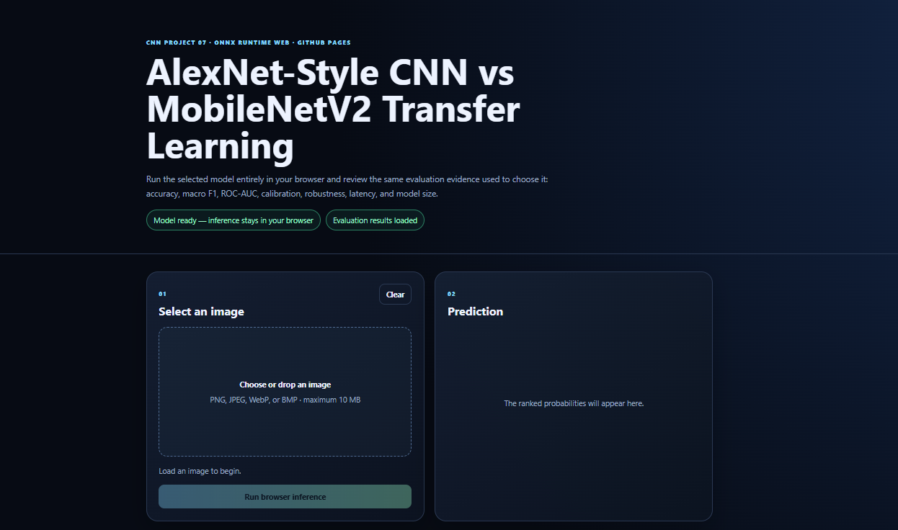
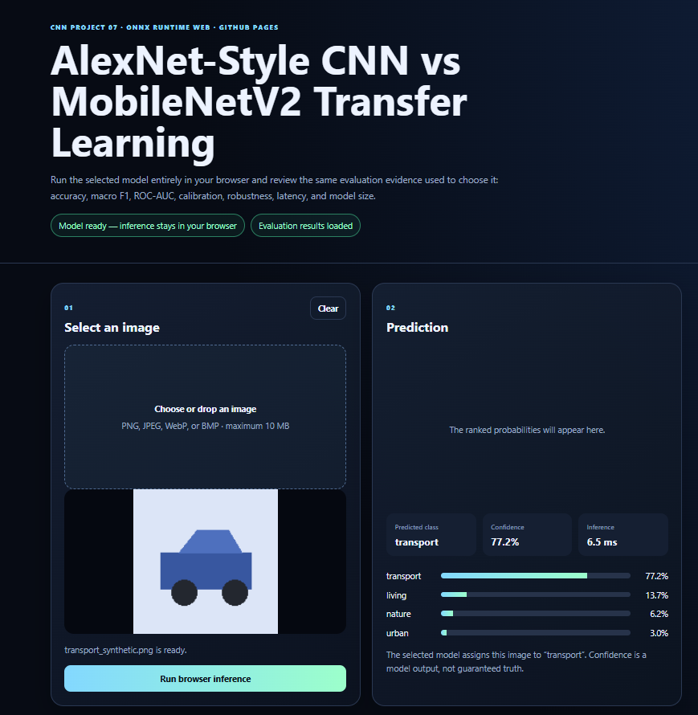
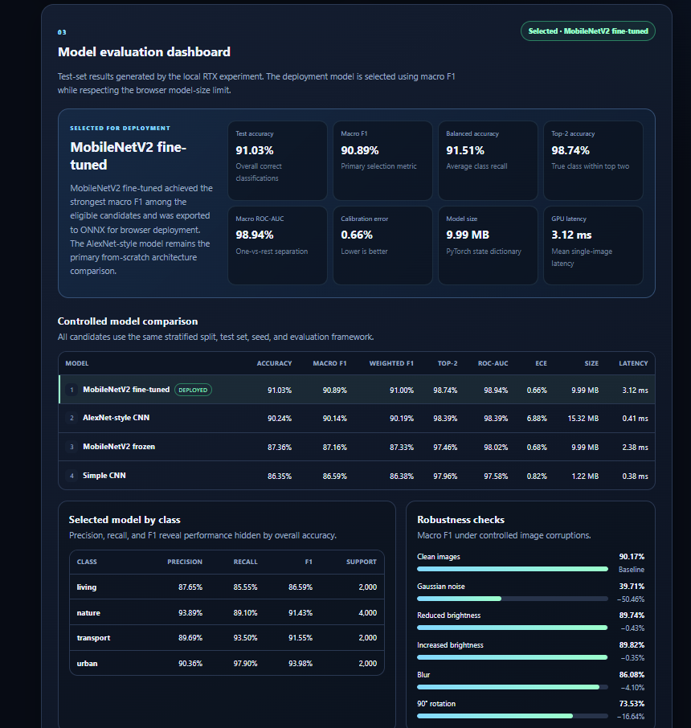
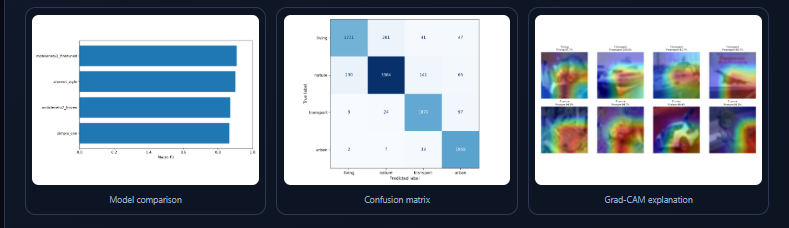

# CNN Model Comparison with AlexNet-Style Networks, MobileNetV2, and ONNX Runtime Web

[](https://www.python.org/)
[](https://pytorch.org/)
[](https://pytorch.org/vision/stable/models/alexnet.html)
[](https://pytorch.org/vision/stable/models/mobilenetv2.html)
[](https://onnx.ai/)
[](https://onnxruntime.ai/docs/get-started/with-javascript/web.html)
[](https://unit-mole.github.io/cnn-projects/)
[](https://github.com/unit-mole/cnn-projects/actions/workflows/cnn-projects-pages.yml)
[](../LICENSE)

An end-to-end computer-vision project that compares a **Simple CNN**, an **AlexNet-style CNN trained from scratch**, **frozen MobileNetV2 transfer learning**, and **partially fine-tuned MobileNetV2** on a controlled four-class semantic version of CIFAR-10. The project evaluates all candidates on the same split, selects the strongest model using **macro F1**, exports it to **ONNX**, publishes real evaluation evidence, and performs inference directly in the browser through **ONNX Runtime Web**.

**Status:** Portfolio-ready and deployed  
**Live demo:** [Open the CNN Model Comparison Browser Application](https://unit-mole.github.io/cnn-projects/)  
**Primary stack:** Python · PyTorch · torchvision · CNNs · AlexNet-style architecture · MobileNetV2 · scikit-learn · ONNX · ONNX Runtime Web · JavaScript · HTML · CSS · GitHub Actions · GitHub Pages

---

## Responsible Use

This project is intended for educational, technical-learning, and portfolio demonstration purposes.

- The model supports only four semantic groups derived from CIFAR-10.
- These labels are regrouped object categories, not a true high-resolution scene-classification dataset.
- High-resolution real-world images can differ significantly from the small CIFAR-10 training images.
- The classifier always selects one of the known classes, even when an image is outside the training distribution.
- A high softmax confidence score does not guarantee that the prediction is correct.
- Blurry, edited, abstract, synthetic, rotated, or unsupported images may produce unreliable results.
- Uploaded images are processed locally in the browser and are not sent to a prediction server.
- Grad-CAM is an interpretability visualization and must not be presented as proof of causal model reasoning.
- The application must not be used as the sole basis for medical, legal, security, safety-critical, hiring, insurance, financial, quality-release, or production decisions.

---

## Business Problem

Organizations increasingly use image classification to assist visual inspection, product categorization, asset routing, inventory review, defect triage, and image-based workflow automation. A useful computer-vision solution should not only produce predictions; it should also compare reasonable model alternatives, evaluate class-level behavior, measure efficiency, explain selected predictions, and support a practical deployment path.

This project answers:

> Can multiple CNN strategies be trained and compared fairly on the same image-classification task, ranked using robust evaluation metrics, converted into a browser-compatible ONNX model, and deployed as a private static application without a Python backend?

The deployed application returns:

- Predicted semantic class
- Confidence score
- Ranked probabilities for all four classes
- Browser inference time
- Selected-model information
- Test accuracy and macro F1
- Balanced accuracy and top-2 accuracy
- Macro ROC-AUC and calibration error
- Model-size and native GPU-latency measurements
- Four-model comparison table
- Per-class precision, recall, F1-score, and support
- Robustness results
- Confusion matrix
- Grad-CAM examples
- Responsible-use and limitation guidance

---

## Project Objective

Build a professional CNN-based image-classification solution that can:

1. Download and validate CIFAR-10.
2. Regroup the ten original labels into four semantic categories.
3. Create deterministic stratified training and validation splits.
4. Resize source images from 32 × 32 to 96 × 96.
5. Apply controlled data augmentation during training.
6. Train a Simple CNN baseline from scratch.
7. train an AlexNet-style CNN from scratch.
8. Train a frozen ImageNet-pretrained MobileNetV2 classifier.
9. Partially fine-tune the final MobileNetV2 feature blocks.
10. Compare all four models using the same validation and test sets.
11. Evaluate accuracy, balanced accuracy, precision, recall, macro F1, weighted F1, top-2 accuracy, ROC-AUC, calibration, size, and latency.
12. Generate classification reports, confusion matrices, learning curves, and prediction galleries.
13. Test the selected model under controlled image corruptions.
14. Generate Grad-CAM explanations.
15. Select the deployment model using macro F1.
16. Export the selected PyTorch model to ONNX.
17. Run inference entirely in the browser through ONNX Runtime Web.
18. Publish the application and evaluation dashboard through GitHub Pages.

---

## Dataset

The project uses **CIFAR-10**, regrouped into four semantic categories.

| Property | Value |
|---|---|
| Task | Multi-class image classification |
| Original dataset | CIFAR-10 |
| Original classes | 10 object categories |
| Project classes | 4 semantic groups |
| Source image size | 32 × 32 pixels |
| Color mode | RGB |
| Training images | 42,000 |
| Validation images | 8,000 |
| Test images | 10,000 |
| Model input size | 96 × 96 × 3 |
| Browser tensor layout | NCHW |
| Output | 4 classification logits |
| Split strategy | Deterministic stratified split |
| Random seed | 42 |

### Semantic class mapping

| Project class | Original CIFAR-10 classes |
|---|---|
| `living` | cat, dog |
| `nature` | bird, deer, frog, horse |
| `transport` | airplane, ship |
| `urban` | automobile, truck |

The grouping creates different class frequencies because each semantic group contains a different number of original CIFAR-10 categories. For that reason, the project uses class-balanced loss weights and selects the deployment model using **macro F1**, which gives each semantic group equal importance.

The complete CIFAR-10 archive is downloaded locally and is not committed to the repository. Safe sample images, metadata, reports, charts, and deployment artifacts are retained.

---

## Tools and Technologies

| Area | Technology |
|---|---|
| Language | Python, JavaScript |
| Deep learning | PyTorch |
| Vision library | torchvision |
| From-scratch baselines | Simple CNN, AlexNet-style CNN |
| Transfer-learning architecture | MobileNetV2 |
| Data processing | NumPy, pandas |
| Dataset splitting | scikit-learn |
| Image processing | Pillow, torchvision transforms |
| Evaluation | scikit-learn, Matplotlib |
| Explainability | Grad-CAM |
| Model exchange | ONNX |
| Native ONNX dependency | ONNX Runtime |
| Browser inference | ONNX Runtime Web |
| Browser execution provider | WebAssembly |
| Web interface | HTML, CSS, JavaScript |
| Testing | pytest, structure validation, JSON validation, JavaScript syntax checks |
| Automation | GitHub Actions |
| Hosting | GitHub Pages |
| Training acceleration | CUDA mixed precision |
| Local training GPU | NVIDIA GeForce RTX 5090 |
| Deployment format | FP32 ONNX |

---

## Project Workflow

```text
CIFAR-10 images and labels
          │
          ▼
Map 10 original labels into 4 semantic groups
          │
          ▼
Deterministic stratified split
          │
          ├── Training:   42,000 images
          ├── Validation:  8,000 images
          └── Test:       10,000 images
          │
          ▼
Resize to 96 × 96 and apply ImageNet normalization
          │
          ├───────────────────────────────────────────────────────────┐
          ▼                 ▼                      ▼                   ▼
     Simple CNN       AlexNet-style CNN     MobileNetV2 frozen   MobileNetV2
     from scratch       from scratch        transfer learning    partial fine-tuning
          │                 │                      │                   │
          └─────────────────┴──────────────────────┴───────────────────┘
                                      │
                                      ▼
                         Controlled model comparison
                                      │
                                      ▼
          Accuracy, balanced accuracy, precision, recall and F1
                                      │
                                      ▼
             Top-2 accuracy, ROC-AUC and calibration analysis
                                      │
                                      ▼
          Confusion matrices, learning curves and error analysis
                                      │
                                      ▼
               Parameter, model-size and latency comparison
                                      │
                                      ▼
                       Select winner using macro F1
                                      │
                         ┌────────────┴────────────┐
                         ▼                         ▼
                Grad-CAM explanations      Robustness evaluation
                         │                         │
                         └────────────┬────────────┘
                                      ▼
                           Export selected model
                               to FP32 ONNX
                                      │
                                      ▼
                    Publish metrics and visual evidence
                                      │
                                      ▼
                   ONNX Runtime Web browser application
                                      │
                                      ▼
                  Combined GitHub Pages deployment workflow
```

---

## Image Preprocessing

Equivalent preprocessing is used during evaluation, ONNX export, and browser inference.

- RGB image conversion
- Resize to 96 × 96
- Pixel rescaling to the `[0, 1]` range
- ImageNet channel-wise normalization
- NCHW tensor conversion
- Float32 data type
- Batch-dimension handling
- Four-class label mapping
- File-type validation
- Maximum browser upload-size validation
- Corrupt-image and inference-error handling

ImageNet normalization values:

```text
Mean: [0.485, 0.456, 0.406]
Std:  [0.229, 0.224, 0.225]
```

Maintaining equivalent preprocessing in Python and JavaScript is essential. A mismatch between the training and browser pipelines can reduce classification quality even when the exported ONNX graph is correct.

---

## Data Augmentation

Training-time transformations improve generalization while preserving semantic meaning.

The pipeline uses:

- Random resized crop to 96 × 96
- Crop scale between 0.80 and 1.00
- Crop aspect-ratio range between 0.90 and 1.10
- Random horizontal flipping
- Brightness jitter
- Contrast jitter
- Saturation jitter
- ImageNet normalization

Validation and test images use deterministic resizing and normalization only.

Aggressive distortion is avoided because the original CIFAR-10 images contain limited visual detail.

---

## Simple CNN Baseline

The Simple CNN provides a compact from-scratch baseline.

```text
Input: 96 × 96 × 3
        ↓
Conv 3 × 3, 32 filters
Batch normalization + ReLU + max pooling
        ↓
Conv 3 × 3, 64 filters
Batch normalization + ReLU + max pooling
        ↓
Conv 3 × 3, 128 filters
Batch normalization + ReLU + max pooling
        ↓
Conv 3 × 3, 192 filters
ReLU + adaptive average pooling
        ↓
Dropout
        ↓
Linear classification layer
        ↓
4 output logits
```

Key properties:

- Trained completely from scratch
- 315,844 parameters
- Approximately 1.22 MB PyTorch state dictionary
- Fastest and smallest model in the comparison
- Useful baseline for measuring the value of deeper and pretrained alternatives

---

## AlexNet-Style CNN Architecture

The AlexNet-style network is the primary from-scratch architecture demonstration.

```text
Input: 96 × 96 × 3
        ↓
Conv 11 × 11, 96 filters, stride 4
ReLU + batch normalization + max pooling
        ↓
Conv 5 × 5, 256 filters
ReLU + batch normalization + max pooling
        ↓
Conv 3 × 3, 384 filters
ReLU
        ↓
Conv 3 × 3, 384 filters
ReLU
        ↓
Conv 3 × 3, 256 filters
ReLU
        ↓
Adaptive average pooling
        ↓
Dense 512 + ReLU + dropout
        ↓
Dense 256 + ReLU
        ↓
4 output logits
```

Key properties:

- Built and trained from scratch
- AlexNet-inspired convolutional progression
- Batch normalization added for modern training stability
- Adaptive pooling reduces dependence on a fixed flattening size
- 4,011,844 trainable parameters
- Approximately 15.32 MB PyTorch state dictionary
- Competitive test macro F1 of 90.14%

This is intentionally described as **AlexNet-style**, not as a pretrained AlexNet model.

---

## MobileNetV2 Transfer-Learning Architecture

The project uses the ImageNet-pretrained torchvision MobileNetV2 backbone.

The original ImageNet classifier is replaced with:

```text
MobileNetV2 feature extractor
        ↓
Dropout 0.30
        ↓
Linear layer: 1,280 → 256
        ↓
Batch normalization
        ↓
ReLU
        ↓
Dropout 0.25
        ↓
Linear layer: 256 → 4
```

Two transfer-learning strategies are evaluated.

### Frozen MobileNetV2

- The feature-extraction backbone remains frozen.
- Only the replacement classifier is trained.
- Trainable parameters: 329,476.
- This isolates the value of pretrained visual features with limited adaptation.

### Partially Fine-Tuned MobileNetV2

- The final four MobileNetV2 feature blocks are unfrozen.
- Earlier feature blocks remain frozen.
- Trainable parameters: 1,855,556.
- A lower learning rate is used during fine-tuning.
- This model achieved the strongest macro F1 and was selected for deployment.

---

## Training Strategy

All four candidates use the same dataset split and evaluation protocol.

| Setting | Value |
|---|---|
| Random seed | 42 |
| Batch size | 128 |
| Image size | 96 × 96 |
| Loss | Class-weighted cross-entropy |
| Optimizer | AdamW |
| Weight decay | 0.0001 |
| Scheduler | ReduceLROnPlateau |
| Scheduler factor | 0.5 |
| Scheduler patience | 2 epochs |
| Early-stopping patience | 5 epochs |
| Mixed precision | Enabled on CUDA |
| Checkpoint policy | Preserve best validation-accuracy state |
| Deployment-selection metric | Macro F1 |

### Model-specific schedules

| Model | Maximum epochs | Learning rate |
|---|---:|---:|
| Simple CNN | 22 | 0.001 |
| AlexNet-style CNN | 30 | 0.0005 |
| MobileNetV2 frozen | 15 | 0.001 |
| MobileNetV2 fine-tuned | 10 | 0.00002 |

The completed experiment ran on:

```text
PyTorch: 2.13.0+cu130
CUDA available: True
CUDA version: 13.0
GPU: NVIDIA GeForce RTX 5090
Mixed precision: True
```

---

## Model Results

| Model | Best Validation Accuracy | Test Accuracy | Balanced Accuracy | Macro F1 | Weighted F1 | Top-2 Accuracy | Parameters | Model Size | Mean GPU Latency |
|---|---:|---:|---:|---:|---:|---:|---:|---:|---:|
| Simple CNN | 86.30% | 86.35% | 87.55% | 86.59% | 86.38% | 97.96% | 315,844 | 1.22 MB | 0.384 ms |
| AlexNet-style CNN | 90.05% | 90.24% | 90.02% | 90.14% | 90.19% | 98.39% | 4,011,844 | 15.32 MB | 0.411 ms |
| MobileNetV2 frozen | 87.36% | 87.36% | 88.34% | 87.16% | 87.33% | 97.46% | 2,553,348 | 9.99 MB | 2.378 ms |
| **MobileNetV2 fine-tuned** | **91.39%** | **91.03%** | **91.51%** | **90.89%** | **91.00%** | **98.74%** | **2,553,348** | **9.99 MB** | **3.119 ms** |

### Selected-model metrics

| Metric | Result |
|---|---:|
| Test accuracy | 91.03% |
| Balanced accuracy | 91.51% |
| Macro precision | 90.40% |
| Macro recall | 91.51% |
| Macro F1 | 90.89% |
| Weighted F1 | 91.00% |
| Top-2 accuracy | 98.74% |
| Macro one-vs-rest ROC-AUC | 98.94% |
| Negative log likelihood | 0.2327 |
| Brier score | 0.1293 |
| Expected calibration error | 0.66% |
| Total parameters | 2,553,348 |
| Trainable parameters | 1,855,556 |
| PyTorch state-dictionary size | 9.99 MB |
| Mean native GPU latency | 3.119 ms |

### Comparison summary

- MobileNetV2 fine-tuning achieved the strongest macro F1 and was selected for deployment.
- Fine-tuning improved test accuracy by approximately **3.67 percentage points** over the frozen MobileNetV2 model.
- The fine-tuned model exceeded the AlexNet-style network by approximately **0.79 percentage points in test accuracy**.
- The fine-tuned model exceeded the AlexNet-style network by approximately **0.75 percentage points in macro F1**.
- The AlexNet-style CNN still reached a competitive **90.14% macro F1 without pretrained feature extraction**.
- The Simple CNN was the smallest candidate at approximately **1.22 MB**.
- Every model achieved at least **97.46% top-2 accuracy**.
- Native GPU latency is hardware-specific and must not be interpreted as browser latency.

---

## Evaluation

The evaluation pipeline includes:

- Test accuracy
- Balanced accuracy
- Macro precision
- Macro recall
- Per-class precision
- Per-class recall
- Per-class F1-score
- Macro F1-score
- Weighted F1-score
- Top-2 accuracy
- Macro one-vs-rest ROC-AUC
- Negative log likelihood
- Brier score
- Expected calibration error
- Classification reports
- Confusion matrices
- Training and validation learning curves
- Correct-prediction galleries
- High-confidence error galleries
- Parameter-count comparison
- Trainable-parameter comparison
- Model-state size
- Mean, median, and p95 latency
- Robustness testing
- Grad-CAM explanations

### Why multiple metrics matter

- **Accuracy** measures the overall percentage of correct classifications.
- **Balanced accuracy** averages recall across classes.
- **Precision** measures how reliable predictions for a class are.
- **Recall** measures how many real examples of a class are captured.
- **F1-score** balances precision and recall.
- **Macro F1** gives every semantic group equal importance.
- **Weighted F1** accounts for class support.
- **Top-2 accuracy** checks whether the true class appears among the two strongest predictions.
- **ROC-AUC** measures one-vs-rest class separation.
- **Calibration metrics** compare confidence with observed correctness.
- **Confusion matrices** reveal systematic class confusion.
- **Latency and model size** support deployment trade-off analysis.

---

## Browser Demo

The static application performs inference locally in the visitor's browser.

It supports:

- PNG, JPEG, WebP, and BMP images
- Drag-and-drop or file selection
- Image preview
- Client-side file validation
- Maximum 10 MB upload size
- Trained ONNX inference
- WebAssembly execution through ONNX Runtime Web
- Predicted class
- Confidence score
- Ranked probabilities for all four classes
- Browser inference time
- Model-ready status
- Real selected-model metrics
- Four-model leaderboard
- Per-class evaluation
- Robustness results
- Confusion matrix
- Grad-CAM visualization
- Responsible-use information

No Python backend is required. Uploaded images remain in the browser.

### Live Application

[](https://unit-mole.github.io/cnn-projects/)

### Application Overview



*Browser-based CNN model-comparison application deployed through GitHub Pages and ONNX Runtime Web.*

### Prediction Example



*Example browser inference displaying the uploaded image, predicted semantic group, confidence, ranked class probabilities, and inference time.*

### Model Leaderboard



*Controlled comparison of the Simple CNN, AlexNet-style CNN, frozen MobileNetV2, and partially fine-tuned MobileNetV2.*

### Selected-Model Confusion Matrix



*Confusion matrix for the selected fine-tuned MobileNetV2 deployment model.*

---

## Browser Inference Workflow

```text
User selects or drops an image
          │
          ▼
Browser validates file type and file size
          │
          ▼
Image is decoded into an HTML image element
          │
          ▼
Canvas resizes the image to 96 × 96
          │
          ▼
Pixels are rescaled and normalized
          │
          ▼
NCHW Float32 tensor is created
          │
          ▼
ONNX Runtime Web loads model/model.onnx
          │
          ▼
WebAssembly executes the ONNX graph
          │
          ▼
Model returns four logits
          │
          ▼
Stable softmax converts logits to scores
          │
          ▼
All four semantic classes are ranked
          │
          ▼
Prediction, confidence, probabilities,
and browser inference time are displayed
```

---

## ONNX Export and Deployment Model

The selected fine-tuned MobileNetV2 checkpoint is exported from PyTorch to ONNX.

| Deployment property | Value |
|---|---|
| Selected model | `mobilenetv2_finetuned` |
| Selection metric | Macro F1 |
| ONNX opset | 18 |
| Precision | FP32 |
| Input name | `input` |
| Output name | `logits` |
| Example input shape | `1 × 3 × 96 × 96` |
| Batch dimension | Dynamic |
| Output classes | 4 |
| ONNX file size | Approximately 10.2 MB |
| Browser runtime | ONNX Runtime Web |
| Browser provider | WebAssembly |
| Deployment decision | Accepted |

The export script:

1. Reads the selected-model record.
2. Reconstructs the matching architecture.
3. Loads `models/deployment_model.pt`.
4. Exports a dynamic-batch ONNX graph.
5. Writes the model to `models/onnx_model/model.onnx`.
6. Copies the browser artifact to `web/model/model.onnx`.
7. Saves conversion metadata.
8. Updates the web metadata to mark the model as deployment-ready.

---

## Grad-CAM Explainability

The selected model receives Grad-CAM visualizations generated from its final convolutional feature layer.

The method:

1. Runs a forward pass for a test image.
2. Captures feature-map activations.
3. Backpropagates the selected class score.
4. Averages the gradients spatially.
5. Uses those averages as channel weights.
6. Combines the weighted feature maps.
7. Applies ReLU.
8. Resizes the activation map to the input-image size.
9. Overlays the heat map on the denormalized image.

The generated grid displays:

- True semantic class
- Predicted semantic class
- Prediction confidence
- Activation overlay

Grad-CAM highlights image regions associated with a prediction; it does not prove causal reasoning.

Generated artifact:

```text
outputs/mobilenetv2_finetuned/gradcam.png
```

The web dashboard publishes a copy at:

```text
web/evaluation/selected_gradcam.png
```

---

## Robustness Evaluation

The selected model is evaluated on 1,500 test images under controlled conditions.

Test conditions include:

- Clean images
- Gaussian noise
- Reduced brightness
- Increased brightness
- Blur
- 90-degree rotation

For each condition, the pipeline records:

- Macro F1
- Drop from clean-image macro F1

The results are displayed inside the browser evaluation dashboard. These checks provide a controlled view of sensitivity to image corruption; they are not a substitute for comprehensive out-of-distribution or production validation.

---

## Model Artifacts

| Artifact | Purpose |
|---|---|
| `models/deployment_model.pt` | Selected PyTorch deployment checkpoint |
| `models/onnx_model/model.onnx` | Exported ONNX model |
| `models/onnx_model/conversion_summary.json` | ONNX input, output, class, and normalization metadata |
| `web/model/model.onnx` | Browser deployment model |
| `web/model/conversion_summary.json` | Browser copy of conversion metadata |
| `outputs/model_leaderboard.csv` | Complete four-model comparison |
| `outputs/model_leaderboard.png` | Visual model leaderboard |
| `outputs/selected_deployment_model.json` | Deployment-selection record |
| `outputs/experiment_summary.json` | Consolidated experiment summary |
| `outputs/runtime_environment.json` | Training hardware and runtime information |
| `outputs/<model>/metrics.json` | Model-level test metrics |
| `outputs/<model>/classification_report.json` | Class-level metrics |
| `outputs/<model>/confusion_matrix.png` | Confusion-matrix visualization |
| `outputs/<model>/training_accuracy.png` | Training and validation accuracy |
| `outputs/<model>/training_loss.png` | Training and validation loss |
| `outputs/<model>/correct_predictions.png` | Correct-prediction gallery |
| `outputs/<model>/high_confidence_errors.png` | Error-analysis gallery |
| `outputs/mobilenetv2_finetuned/gradcam.png` | Grad-CAM explanation grid |
| `outputs/mobilenetv2_finetuned/robustness_metrics.json` | Corruption-test results |
| `web/evaluation_metrics.json` | Static website evaluation payload |
| `web/evaluation/` | Evaluation images published with the application |

The original CIFAR-10 archive and virtual environment are excluded from Git tracking.

---

## Run the Browser Demo Locally

### 1. Open the project folder

```bat
cd /d "C:\Users\atripathi\OneDrive - Veralto\Desktop\AI Codes\GIT Projects\cnn-projects\07-image-classification-alexnet-transfer-learning"
```

### 2. Start a local HTTP server

```bat
python -m http.server 8000 --directory web
```

The Project 7 virtual environment can also be used explicitly:

```bat
.venv\Scripts\python.exe -m http.server 8000 --directory web
```

### 3. Open the application

```text
http://localhost:8000/
```

Do not open `index.html` directly with a `file://` URL. The application loads JSON, JavaScript, WebAssembly resources, evaluation images, and the ONNX model over HTTP.

---

## Run the Python Project Locally

### 1. Create and activate the virtual environment

**Windows**

```bat
py -3.12 -m venv .venv
call .venv\Scripts\activate.bat
python -m pip install --upgrade pip setuptools wheel
```

### 2. Install CUDA-enabled PyTorch

The completed RTX workflow used:

```bat
python -m pip install torch torchvision --index-url https://download.pytorch.org/whl/cu130
```

### 3. Install project dependencies

```bat
python -m pip install -r requirements-training.txt
```

### 4. Verify CUDA

```bat
python -c "import torch; print('PyTorch:', torch.__version__); print('CUDA:', torch.cuda.is_available()); print('GPU:', torch.cuda.get_device_name(0) if torch.cuda.is_available() else 'Not detected')"
```

### 5. Validate the project

```bat
python scripts\validate_project.py
python -m pytest -q
```

### 6. Launch JupyterLab

```bat
jupyter lab notebooks\07_pytorch_cnn_model_comparison.ipynb
```

A dedicated kernel can be registered with:

```bat
python -m ipykernel install --user --name project07-cnn-rtx --display-name "Project 07 - CNN RTX 5090"
```

### 7. Run the full experiment

```bat
python -u scripts\run_full_experiment.py
```

### 8. Export the selected model

```bat
python scripts\export_to_onnx.py
```

### 9. Publish evaluation evidence into the static application

```bat
python scripts\sync_web_evaluation.py
```

### 10. Validate the deployment assets

```bat
python scripts\validate_project.py --require-onnx
python -m pytest -q
```

---

## Windows Convenience Scripts

The `windows/` folder provides a native-Windows workflow matching the repository's other GPU projects.

| Script | Purpose |
|---|---|
| `windows/01_setup_environment.bat` | Create and configure the local environment |
| `windows/02_start_notebook.bat` | Launch the Project 7 notebook |
| `windows/03_run_full_experiment.bat` | Run the complete four-model experiment |
| `windows/04_export_and_test_browser.bat` | Export ONNX and test the static web application |
| `windows/README_WINDOWS.md` | Windows-specific usage guide |

---

## Deployment

- **Repository:** `unit-mole/cnn-projects`
- **Source branch:** `main`
- **GitHub Pages source:** GitHub Actions
- **Combined workflow:** `.github/workflows/cnn-projects-pages.yml`
- **Published Project 7 source:** `07-image-classification-alexnet-transfer-learning/web/`
- **Live application:** https://unit-mole.github.io/cnn-projects/
- **Dedicated project path:** https://unit-mole.github.io/cnn-projects/07-image-classification-alexnet-transfer-learning/

The repository uses one combined GitHub Pages workflow so that Projects 03, 04, and 07 can remain online simultaneously. The workflow:

1. Checks out the repository.
2. Configures GitHub Pages.
3. Verifies the required project web entry points.
4. Creates one combined `_site` directory.
5. Publishes Project 7 at the repository Pages root.
6. Publishes Projects 03, 04, and 07 at their dedicated subpaths.
7. Uploads one GitHub Pages artifact.
8. Deploys through the `github-pages` environment.

---

## Project Structure

```text
cnn-projects/
├── .github/
│   └── workflows/
│       └── cnn-projects-pages.yml
│
├── 07-image-classification-alexnet-transfer-learning/
│   ├── configs/
│   │   └── experiment_config.json
│   │
│   ├── data/
│   │   ├── README_data.md
│   │   └── sample_images/
│   │
│   ├── images/
│   │   ├── Demo_Testing.png
│   │   ├── project07_browser_demo.png
│   │   ├── project07_confusion_matrix.png
│   │   └── project07_model_leaderboard.png
│   │
│   ├── models/
│   │   ├── deployment_model.pt
│   │   └── onnx_model/
│   │       ├── conversion_summary.json
│   │       └── model.onnx
│   │
│   ├── notebooks/
│   │   ├── 07_pytorch_cnn_model_comparison.ipynb
│   │   └── README.md
│   │
│   ├── outputs/
│   │   ├── alexnet_style/
│   │   ├── mobilenetv2_finetuned/
│   │   ├── mobilenetv2_frozen/
│   │   ├── simple_cnn/
│   │   ├── experiment_summary.json
│   │   ├── model_leaderboard.csv
│   │   ├── model_leaderboard.png
│   │   └── selected_deployment_model.json
│   │
│   ├── scripts/
│   │   ├── export_to_onnx.py
│   │   ├── run_full_experiment.py
│   │   ├── run_local_web_server.py
│   │   ├── sync_web_evaluation.py
│   │   └── validate_project.py
│   │
│   ├── src/
│   │   ├── artifacts.py
│   │   ├── class_mapping.py
│   │   ├── config.py
│   │   ├── dataset_loader.py
│   │   ├── evaluation.py
│   │   ├── experiment_runner.py
│   │   ├── explainability.py
│   │   ├── model_export.py
│   │   ├── models.py
│   │   ├── reproducibility.py
│   │   ├── robustness.py
│   │   ├── training.py
│   │   └── visualization.py
│   │
│   ├── tests/
│   │   ├── conftest.py
│   │   ├── test_class_mapping.py
│   │   ├── test_config.py
│   │   └── test_web_assets.py
│   │
│   ├── web/
│   │   ├── evaluation/
│   │   ├── model/
│   │   ├── sample_images/
│   │   ├── app.js
│   │   ├── evaluation_metrics.json
│   │   ├── index.html
│   │   ├── metadata.json
│   │   └── style.css
│   │
│   ├── windows/
│   ├── README.md
│   ├── README_GITHUB_PAGES.md
│   ├── requirements-ci.txt
│   ├── requirements-training.txt
│   └── requirements.txt
```

---

## Limitations

- CIFAR-10 source images are only 32 × 32 pixels.
- The four target labels are manually regrouped semantic categories.
- The benchmark is not a true scene-recognition dataset.
- Real-world high-resolution photographs can differ substantially from the training distribution.
- The classifier always chooses one of four known groups, even for unsupported content.
- `living` and `nature` may be confused for visually ambiguous animals.
- `transport` and `urban` may be confused for road vehicles or mixed scenes.
- Softmax confidence is not guaranteed probability.
- Calibration is measured but not fully corrected with post-training calibration.
- Browser performance varies by device, browser, memory, network speed, and WebAssembly implementation.
- Native RTX latency is not equivalent to browser latency.
- A 90-degree rotation is intentionally severe and may substantially reduce performance.
- Grad-CAM is not a causal explanation.
- The model has not been validated for safety-critical or production use.

---

## Future Improvements

- Add a dedicated repository landing page instead of using Project 7 as the root application.
- Add one-click browser sample images.
- Add confidence-threshold guidance and abstention behavior.
- Add temperature scaling or another post-training calibration method.
- Add reliability diagrams to the browser dashboard.
- Add normalized confusion matrices.
- Add browser integration tests using Playwright.
- Add progressive ONNX model-download feedback.
- Add WebGPU execution when browser support and operator compatibility are validated.
- Evaluate ONNX graph optimization.
- Evaluate FP16 or INT8 candidates using explicit acceptance thresholds.
- Compare MobileNetV2 with EfficientNet, ConvNeXt, ResNet, and MobileViT.
- Evaluate on a true scene-classification dataset.
- Add broader corruption benchmarks and out-of-distribution testing.
- Add class-specific Grad-CAM and error-analysis galleries.
- Publish the selected PyTorch and ONNX models through Hugging Face.

---

## Skills Demonstrated

- Convolutional neural networks
- AlexNet-inspired architecture design
- CNN development from scratch
- Transfer learning
- Partial fine-tuning
- MobileNetV2
- PyTorch model training
- torchvision datasets and transforms
- Native Windows CUDA workflows
- Mixed-precision GPU training
- Multi-class image classification
- Deterministic stratified splitting
- Class-weighted training
- Accuracy and balanced-accuracy evaluation
- Precision, recall, macro F1, and weighted F1
- Top-k accuracy
- Multi-class ROC-AUC
- Confidence calibration analysis
- Confusion-matrix analysis
- Error analysis
- Parameter and latency benchmarking
- Robustness evaluation
- Grad-CAM interpretability
- ONNX export
- Dynamic batch configuration
- Browser-based machine learning
- ONNX Runtime Web
- JavaScript inference pipelines
- Static web application development
- Automated evaluation-data publishing
- pytest validation
- GitHub Actions
- Combined GitHub Pages deployment
- Responsible AI communication
- Portfolio-focused ML engineering

---

## Portfolio Positioning

**One-line description:** Four-model CNN comparison featuring Simple CNN and AlexNet-style networks from scratch, frozen and fine-tuned MobileNetV2 transfer learning, comprehensive evaluation, Grad-CAM and robustness analysis, ONNX export, and private browser inference through GitHub Pages.

**Pinned repository description:** End-to-end computer-vision portfolio project comparing from-scratch CNNs with MobileNetV2 transfer learning, selecting the strongest model using macro F1, exporting to ONNX, publishing evaluation evidence, and deploying browser inference with ONNX Runtime Web.

This project connects naturally to a Quality Data Scientist background because controlled image classification can support visual inspection, product categorization, defect triage, quality review, image-based anomaly analysis, and applied AI for inspection workflows.

---

## Author

**Anmol Tripathi**

Quality Data Scientist building a professional portfolio in Data Science, Machine Learning, Applied AI, Computer Vision, Analytics Engineering, and Quality Analytics.
